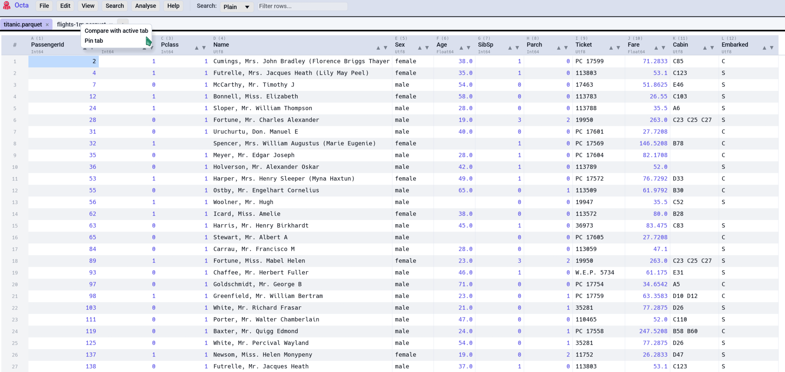

# First Steps

This is a short tour of Octa for someone who has just launched it for
the first time. About five minutes to read; you can skim the rest of
the documentation after.

## Opening a file

Three ways to get a file open:

1. **From the menu**, via `File → Open` (default shortcut **Ctrl+O**),
   which shows a file picker. Multi-select works, and every file you
   pick opens in its own tab.
2. **From recently-opened**, via `File → Recent Files`, which lists
   the last files you opened (configurable count under
   [**Settings → Files**](../reference/settings.md#files)).
3. **From the command line**, with [`octa data.parquet`](../cli/index.md),
   which opens straight into that file. Pass multiple paths and each
   lands in a new tab.

Drag-and-drop from the OS file manager is **not currently supported**
on Linux Wayland sessions. The underlying windowing crate (`winit`)
has not implemented Wayland drag-and-drop yet. On X11, macOS, and
Windows the OS-level hook would land, but Octa does not subscribe to
those drop events today either; use **File → Open** instead.

<!-- SCREENSHOT: first-steps-file-menu.png: File menu open, showing Open / Open Directory / Recent Files / Save / Save As entries. -->

## Anatomy of the window

Once a file is open, the layout is:

- **Toolbar** at the top, with the file menu, edit menu, view menu,
  search box, view-mode controls, and the app logo on the left.
- [**Tab strip**](../usage/tabs-and-sidebar.md) under the toolbar,
  one tab per open file. Right-click a tab for compare option.
  Hover for the full path.
- [**Sidebar**](../usage/tabs-and-sidebar.md#the-folder-sidebar)
  (left-docked by default) appears when you use `File → Open
  Directory…`. Click any file in the tree to open it in a new tab.
- **Central panel**, the actual view of your file. Defaults to the
  [Table view](../usage/table-view.md); switches based on the file
  type ([Markdown](../usage/view-modes/markdown.md) files open in
  Markdown view, [EPUBs](../usage/view-modes/epub-reader.md) in the
  EPUB Reader, `.geojson` files in the
  [Map view](../usage/view-modes/map.md), etc.).
- **Status bar** at the bottom, with row/column counts, selection
  info, zoom level, a navigation field (jump to `R5:C3`), and a busy
  spinner during long operations.

<!-- SCREENSHOT: first-steps-window-anatomy.png: Window with annotations or labels pointing at toolbar / tab strip / sidebar / table / status bar. If annotation isn't easy, just a clean shot of the full window with one file open. -->

## Getting around the table

- **Arrow keys** move the selected cell.
- **Scroll wheel** scrolls vertically. **Shift+Scroll wheel** scrolls
  horizontally.
- **Click** a cell to select it. **Double-click** to edit it.
- **Click a row number** (the grey column on the left) to select the
  whole row. **Ctrl+click** adds to the selection; **Shift+click**
  picks a range.
- **Click a column header** to select the whole column.
- **Drag a column header** to reorder columns.
- **Double-click the seam between two column headers** to auto-fit
  the left column's width. **Ctrl+Shift+W** fits *every* column.

To jump quickly: type something like `R5000` or `C3` or
`SomeColumnName` into the navigation field in the status bar (focus
it with **Ctrl+G**) and press Enter.

## Searching

The [search box](../usage/search-and-filter.md) in the toolbar
filters rows in real time, so only rows containing a match are
shown. There are three modes (dropdown next to the box):

- **Plain**, case-insensitive substring (default).
- **Wildcard**, where `*` matches any sequence and `?` matches one
  character.
- **Regex**, a full regular expression.

**Ctrl+F** focuses the search box. **Ctrl+H** opens find-and-replace.

## Editing a cell

Double-click any cell to start editing, and the current text is
selected so you can type to replace it. **Tab** / **Enter** confirm;
**Escape** cancels. Numbers, dates, and booleans parse
automatically based on the column's type. See
[Editing](../usage/editing.md) and
[Date Inference](../reference/date-inference.md) for the full
mechanics.

Need to insert a new row or column? **Edit → Insert Row** /
**Insert Column** opens the right dialog (the column dialog also
accepts a [formula](../usage/formulas.md) like `=A1+B1`).
**Edit → Delete Row** / **Delete Column** removes the selected one.

**Ctrl+Z** undoes; **Ctrl+Y** redoes. Both stacks are visible in
the **Edit** menu.

## Switching view modes

The **View** menu lists every mode applicable to the current file.
Press **F4** to cycle through them. Examples of what triggers what:

| File extension                                    | Default view                                                                           |
|---------------------------------------------------|----------------------------------------------------------------------------------------|
| `.parquet`, `.csv`, `.tsv`, `.xlsx`, `.sqlite`, … | [Table](../usage/table-view.md)                                                        |
| `.md`                                             | [Markdown](../usage/view-modes/markdown.md)                                            |
| `.ipynb`                                          | [Notebook](../usage/view-modes/notebook.md)                                            |
| `.json` / `.jsonl`                                | Table (with [**JSON Tree**](../usage/view-modes/json-and-yaml-tree.md) also available) |
| `.epub`                                           | [EPUB Reader](../usage/view-modes/epub-reader.md)                                      |
| `.geojson`                                        | [Map](../usage/view-modes/map.md)                                                      |
| Any unrecognised text file                        | [Raw Text](../usage/view-modes/raw-text.md)                                            |

Every file can be inspected as a Table or Raw Text regardless. See
the [View modes overview](../usage/view-modes/overview.md) for the
full list.

## Saving

- **File → Save** (Ctrl+S) writes back to the original file in its
  original format.
- **File → Save As** lets you save to a different path or different
  format.
- Closing a tab (or Octa itself) with unsaved changes pops a *"Save?
  Don't Save? Cancel?"* confirmation.

For SQLite / DuckDB sources, saves are **diff-based**: only changed
rows are updated, deleted rows are deleted, new rows are inserted.
Schema changes (rename / add / drop column) are rejected, so do
those in another tool first. See [Saving](../usage/saving.md) for
the per-format mechanics.

## Quick reference

| Action                 | Default shortcut |
|------------------------|------------------|
| Open file              | Ctrl+O           |
| Save                   | Ctrl+S           |
| Search                 | Ctrl+F           |
| Find & Replace         | Ctrl+H           |
| Cycle view mode        | F4               |
| Read-only toggle       | F8               |
| Settings               | F3               |
| Undo / Redo            | Ctrl+Z / Ctrl+Y  |
| Fit all columns        | Ctrl+Shift+W     |
| Reopen last closed tab | Ctrl+Shift+T     |

Every shortcut is remappable under
[**Settings → Shortcuts**](../reference/settings.md). The full table
is on the [Keyboard shortcuts](../reference/shortcuts.md) page.

## See also

- [Supported formats](supported-formats.md) covers what Octa can
  open and what it can write back.
- [Installation](installation.md) walks through Linux, macOS, and
  Windows install routes if you haven't done that yet.
- [Table view](../usage/table-view.md) is the default view's full
  feature set: editing, sorting, selecting.
- [View modes overview](../usage/view-modes/overview.md) covers when
  Octa picks Notebook, Markdown, Map, or Raw automatically.

[Next: Supported formats :material-arrow-right:](supported-formats.md){ .md-button }
