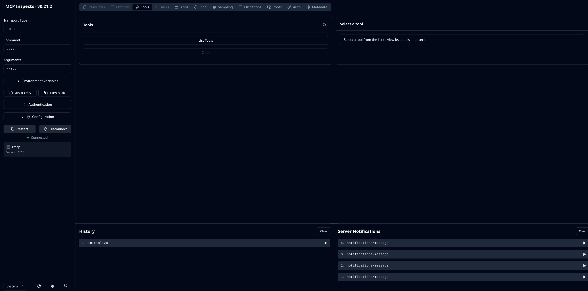

# MCP Setup

Three common MCP clients (Claude Desktop, Claude Code, and the
MCP Inspector) each have a slightly different way to register a
local MCP server. This page walks through all three.

## Prerequisites

1. Octa must be installed and on your `PATH`. Verify with:

    ```bash
    octa --version
    ```

    If you get *"command not found"*, either move the binary somewhere
    on `PATH` (`/usr/local/bin/`, `~/.local/bin/`, `C:\Program
    Files\Octa\`) or use the **full path** in the configurations below
    (`/home/you/octa/target/release/octa`, `C:\Tools\octa.exe`, etc.).

2. Confirm `--mcp` starts the server:

    ```bash
    octa --mcp
    ```

    You should see a one-line startup banner on **stderr**:

    ```
    octa --mcp ready (default row limit: 1000, cell cap: 65536 bytes; …)
    ```

    Press Ctrl+C to stop. Stdout is reserved for JSON-RPC traffic;
    you won't see anything on stdout unless an MCP client is talking
    to it.

## Claude Desktop

Claude Desktop reads its MCP servers from `claude_desktop_config.json`:

| Platform | Path                                                              |
|----------|-------------------------------------------------------------------|
| Linux    | `~/.config/Claude/claude_desktop_config.json`                     |
| macOS    | `~/Library/Application Support/Claude/claude_desktop_config.json` |
| Windows  | `%APPDATA%\Claude\claude_desktop_config.json`                     |

Open the file (create it if it doesn't exist) and add `octa` to the
`mcpServers` block:

```json
{
  "mcpServers": {
    "octa": {
      "command": "octa",
      "args": ["--mcp"]
    }
  }
}
```

If `octa` isn't on `PATH`, use the full path:

```json
{
  "mcpServers": {
    "octa": {
      "command": "/home/you/.local/bin/octa",
      "args": ["--mcp"]
    }
  }
}
```

The AppImage works the same way: point `command` at the AppImage
file directly. No extraction, no wrapper script, no separate
install step. The same single-file binary that opens the GUI also
serves as the MCP endpoint.

```json
{
  "mcpServers": {
    "octa": {
      "command": "/home/you/Octa-x86_64.AppImage",
      "args": ["--mcp"]
    }
  }
}
```

Save the file and **restart Claude Desktop**. You should see the
**hammer icon** (🔨) in the conversation window; click it to
confirm Octa's tools are listed.

Try a prompt:

> What columns does `/path/to/data.parquet` have?

Claude should call `schema` and report the result.

## Claude Code

Claude Code supports `claude mcp add` for one-line registration:

```bash
# User-scoped (available in every project)
claude mcp add octa --scope user -- octa --mcp

# Project-scoped (available only in the current project)
claude mcp add octa --scope project -- octa --mcp
```

Verify:

```bash
claude mcp list
# octa  user  /home/you/.local/bin/octa --mcp
```

Then in any Claude Code session, ask things like:

> Use the octa MCP server to read the schema of `tests/fixtures/sample.csv`.

To remove:

```bash
claude mcp remove octa --scope user
```

## MCP Inspector

The [MCP Inspector](https://github.com/modelcontextprotocol/inspector)
gives you a web UI for exploring an MCP server: list tools, fill in
parameters via forms, see raw JSON responses. The best way to verify
a server works without involving an AI client at all.

```bash
npx @modelcontextprotocol/inspector octa --mcp
```

This spawns Octa under Inspector's control, opens a browser tab, and
shows you every tool plus an interactive form for each.



Requires Node.js (and `npx`) on your `PATH`. The Inspector is the
fastest path to "does my Octa MCP setup work?"

## Other MCP clients

Any client that supports stdio-spawned MCP servers works with Octa.
The pattern is always:

- **command**: `octa` (or the full path to the binary or AppImage)
- **args**: `["--mcp"]`
- **transport**: stdio (the default; no special config needed)

Refer to your client's documentation for the exact config syntax;
the entries above are representative.

## Distribution formats

`octa --mcp` works with every distribution Octa publishes:

- **Plain binary** off the releases page (`/usr/local/bin/octa`,
  `~/.local/bin/octa`, or anywhere on `PATH`).
- **`install.sh`** install (system-wide or user-local).
- **AUR** packages (`octa`, `octa-bin`).
- **AppImage** (`Octa-*-x86_64.AppImage`), pointed at directly as
  the `command`.

No wrapper script or extra installation step is needed in any
case: the same binary that opens the GUI also serves as the MCP
endpoint.

## After setup

Once Octa's tools show up in your client, configure the limits
under Octa's GUI ([**Settings → MCP**](../reference/settings.md#mcp)):

- **Default response row limit**: 1000 by default. Set higher (or
  Unlimited) for analytics workflows where Claude needs to see
  whole tables.
- **Per-cell byte cap**: 65,536 by default. Lower if a BLOB column
  is consistently bloating responses.

The streaming file-loader cap lives under
[**Settings → Performance → Initial-load row cap**](../reference/settings.md#performance)
and defaults to 5,000,000 rows; an Unlimited checkbox next to
the input disables it entirely. Per-MCP-call, pass `unlimited: true`
to any read-bearing tool to lift this cap for that call only.

Settings are read once at server startup. After changing them in
Octa, restart your MCP client (or just the Octa server process) for
them to take effect.

## See also

- [Tools reference](tools/index.md) covers what each tool does and
  the input schemas.
- [Limits & truncation](limits-and-truncation.md) covers how Octa
  keeps responses bounded.
- [Troubleshooting](troubleshooting.md) covers common setup
  failures.
