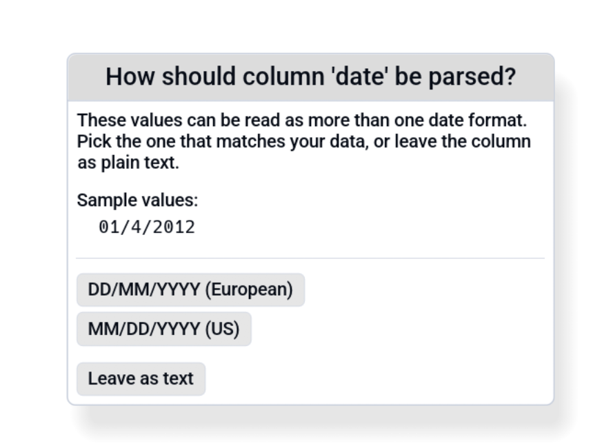

# Date Inference

When Octa opens a text-shaped tabular file (CSV, TSV, JSON, JSONL,
Excel, XML, TOML, YAML, Markdown, DBF), it scans every string
column for a uniform date layout. If **every non-null value** in a
column matches the same date pattern, the column is silently
promoted from `Utf8` to `Date32` (or `Timestamp` if a time
component is present).

The result: dates display as proper dates in the Table view,
sort chronologically, work with SQL `DATE` functions, and round-trip
losslessly into binary formats like Parquet.

This page documents which patterns are detected and what happens
when a column is ambiguous (e.g. `02/03/2024` could be either
DD/MM or MM/DD).

## Why text-formats only

Binary formats (Parquet, Arrow, SQLite, DuckDB, SAS, Stata, SPSS,
RDS, ORC, Avro, HDF5, GeoPackage) already carry **typed** date
columns from disk, so Octa preserves the source typing without
inference. Running inference over them would re-process already-typed
data and risk corrupting it.

The text formats that *do* get the inference pass:

- CSV, TSV
- JSON, JSON Lines
- Excel (`.xlsx`, since strings come back from `calamine` as `Utf8`)
- XML, TOML, YAML
- Markdown table content
- DBF

## Recognised date layouts

Seven date layouts are tried per column. Octa accepts a column only
when **every** non-null cell matches the same one.

| Layout       | Example      | Notes                                               |
|--------------|--------------|-----------------------------------------------------|
| `YYYY-MM-DD` | `2024-01-15` | ISO 8601. Canonical, with no warning when promoted. |
| `YYYY/MM/DD` | `2024/01/15` | ISO order, slash separator.                         |
| `DD.MM.YYYY` | `15.01.2024` | European, dot separator.                            |
| `DD-MM-YYYY` | `15-01-2024` | European, dash.                                     |
| `DD/MM/YYYY` | `15/01/2024` | European, slash.                                    |
| `MM-DD-YYYY` | `01-15-2024` | US, dash.                                           |
| `MM/DD/YYYY` | `01/15/2024` | US, slash.                                          |

Two-digit years (e.g. `15.01.24`) are **not** recognised yet. Files with two-digit years
stay as `Utf8`; you can fix in another tool or use SQL `strptime()`
to convert.

## Recognised datetime layouts

When the column has a time component, seven datetime layouts are
tried, five naive and two timezone-aware:

| Layout                      | Example                     | Notes                                        |
|-----------------------------|-----------------------------|----------------------------------------------|
| `YYYY-MM-DD HH:MM[:SS]`     | `2024-01-15 14:30:00`       | Canonical naive form.                        |
| `YYYY-MM-DDTHH:MM[:SS]`     | `2024-01-15T14:30:00`       | ISO 8601 with `T`, naive.                    |
| `DD.MM.YYYY HH:MM[:SS]`     | `15.01.2024 14:30:00`       | European, dot.                               |
| `DD/MM/YYYY HH:MM[:SS]`     | `15/01/2024 14:30:00`       | European, slash.                             |
| `MM/DD/YYYY HH:MM[:SS]`     | `01/15/2024 14:30:00`       | US, slash.                                   |
| `YYYY-MM-DD HH:MM[:SS]<tz>` | `2024-01-15 14:30:00+02:00` | ISO with space + offset → normalized to UTC. |
| `YYYY-MM-DDTHH:MM[:SS]<tz>` | `2024-01-15T14:30:00Z`      | ISO with `T` + offset → normalized to UTC.   |

Seconds are optional, so `2024-01-15 14:30` parses too.

### Fractional seconds

Fractional seconds (milli / micro / nano) are accepted on every
datetime layout and **preserved verbatim** in the canonical display.
A column of `2024-01-15 14:30:00.123456` round-trips as
`2024-01-15 14:30:00.123456`. Mixed precision within the same column
is fine, each cell keeps the precision it was parsed with;
whole-second rows still render as `2024-01-15 14:30:00` (no trailing
dot). The underlying type is `Timestamp(Microsecond, None)`, so the
fraction also survives a re-export to Parquet / SQLite / DuckDB.

### Timezone offsets

Both `Z` (UTC) and explicit offsets (`+02:00`, `-05:00`, the compact
`+0200`, etc.) are recognised on the two ISO datetime layouts. Every
value is **shifted to UTC** before being stored, so the cell shows the
UTC wall-clock time without an explicit suffix, since the underlying
`Timestamp(Microsecond, None)` cell type has no slot to preserve the
original offset. Examples (mixed-offset column, all normalized):

| Source                      | Stored / displayed        |
|-----------------------------|---------------------------|
| `2024-01-15T14:30:00Z`      | `2024-01-15 14:30:00`     |
| `2024-01-15T14:30:00+02:00` | `2024-01-15 12:30:00`     |
| `2024-01-15T09:00:00-05:00` | `2024-01-15 14:00:00`     |
| `2024-01-15T14:30:00.123Z`  | `2024-01-15 14:30:00.123` |

Because the column is normalized to UTC, the **format-changed banner**
fires (offset stripped, wall-clock time shifted) so you can see the
transformation at a glance.

A column that mixes naive (`2024-01-15T14:30:00`) and tz-aware
(`2024-01-15T14:30:00Z`) values stays as `Utf8`, because those are two
semantically different things and inference refuses to silently
collapse them. Pick one in source data, or pre-process with
[SQL](../usage/sql.md).

Three-letter zone abbreviations (`PST`, `CEST`, …) are **not**
recognised: they're ambiguous (e.g. `IST` means India *or* Israel
depending on context). Convert with `strptime` in SQL if you need
those.

## How inference decides

For each candidate layout, Octa attempts to parse every non-null
value in the column:

1. **No matches**: discard that layout for this column.
2. **Some match, some fail**: discard that layout (Octa won't
   promote a column that's *mostly* dates but has stragglers).
3. **All match**: keep that layout as a candidate.

After all candidates have been tested:

- **Zero candidates** → column stays `Utf8`.
- **One candidate** → column is promoted to `Date32` / `Timestamp`
  using that layout.
- **Multiple candidates** → ambiguity. See below.

The pruning works naturally because `chrono::NaiveDate::parse_from_str`
rejects out-of-range months / days. A single value like `13/04/2024`
already eliminates `MM/DD/YYYY` (month > 12), so any column
containing it can only be `DD/MM/YYYY`, no dialog needed.

Columns that **only** contain values with months ≤ 12 and days ≤ 12
(e.g. all dates in the first 12 days of a month) are the
genuinely-ambiguous cases.

## The ambiguity dialog

When a column is consistent with **multiple** layouts (typically
`DD/MM/YYYY` and `MM/DD/YYYY` both pass), Octa shows a modal:

<!-- SCREENSHOT: date-ambiguity-dialog.png: Modal dialog asking the user to pick between European DD/MM/YYYY and US MM/DD/YYYY for an ambiguous column, with a "Leave as text" escape hatch. Show a few sample values from the column. -->

You pick:

- **European**: promote using DD/MM/YYYY.
- **US**: promote using MM/DD/YYYY.
- **Leave as text**: keep the column as `Utf8`, no promotion.

The dialog shows a few sample values from the column so you have
context. The choice applies only to *that column*; other ambiguous
columns get their own dialog.

When the dialog blocks (multiple files queued), the open queue
**pauses** until you resolve it, so you can answer one file's
modals before the next one's start arriving.

## The "format changed" banner

When a column is promoted using a layout whose source format is
**not** canonical ISO (i.e. anything other than `YYYY-MM-DD`),
Octa shows a dismissible banner at the top of the table:

> Note: The column `created_at` was detected as **DD.MM.YYYY
> (European)** and converted to canonical ISO display
> (`YYYY-MM-DD`). The source file is unchanged. [Dismiss]

Reason: the on-disk values are `15.01.2024` but the table shows
`2024-01-15`. The banner makes that explicit so you're not
surprised when you save.

Suppress globally via
[**Settings → File-Specific → Warn on date format change**](settings.md#file-specific).

The banner has a **Dismiss** button that not only hides it but
also reverts the affected columns back to their source-string
form. Use this when you want to keep the original textual format
on save (Save back to CSV will write `15.01.2024`, not
`2024-01-15`).

## What happens on save

For text-format outputs (CSV / TSV / JSON / etc.), promoted Date
columns write back in canonical ISO `YYYY-MM-DD` form
regardless of what the source format was. That's deliberate, since
ISO sorts correctly and is unambiguous.

For binary outputs (Parquet, SQLite, etc.), the column writes as
its typed form (`Date32`, `Timestamp(Microsecond, None)`).

If you want to preserve the original textual format on save
(e.g. round-tripping a German CSV that uses `DD.MM.YYYY`), click
**Dismiss** on the banner; that reverts the column to `Utf8` and
the original string values are written back unchanged.

## When inference goes wrong

Common failure modes:

| Symptom                                        | Cause                                                               | Fix                                                                                                                                                                                                     |
|------------------------------------------------|---------------------------------------------------------------------|---------------------------------------------------------------------------------------------------------------------------------------------------------------------------------------------------------|
| Column stays `Utf8` despite looking like dates | One value can't parse (typo, blank string, "N/A", placeholder text) | Clean the column or accept the `Utf8` type.                                                                                                                                                             |
| US dates promoted as European (or vice versa)  | All values have month ≤ 12 and day ≤ 12, so both layouts pass       | Pick the right one in the ambiguity dialog. If the file has already loaded with the wrong layout, click **Dismiss** on the "format changed" banner to revert the column to text, then re-open the file. |
| Two-digit year column not detected             | `YY` patterns aren't in the recognised set                          | Stays `Utf8`. Convert in another tool first or use [SQL](../usage/sql.md) `strptime('%d.%m.%y', col)`.                                                                                                  |
| Mixed-format column (some ISO, some European)  | No layout matches *every* value                                     | Stays `Utf8`. The column needs cleaning first.                                                                                                                                                          |

To manually change a column's type after load: right-click the
column header → **Change Type** → pick `String`, `Int64`, `Float64`,
`Boolean`, `Date32`, or `Timestamp(Microsecond, None)`. The entry is
disabled if any cell can't convert under the new type.

## See also

- [Settings → File-Specific](settings.md#file-specific) toggles
  the "Warn on date format change" banner.
- [Supported formats](../getting-started/supported-formats.md)
  lists which formats run inference (text-shaped) vs which preserve
  typed dates (binary).
