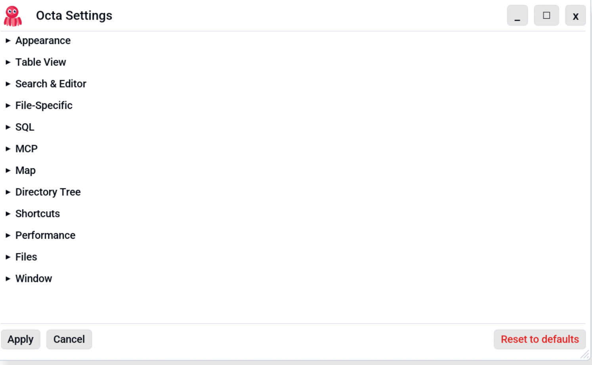

# Settings Reference

Open the Settings dialog via **Help → Settings** (default
shortcut **F3**). Settings are grouped into collapsible sections.

Settings persist to a TOML file:

| Platform | Path                                                                               |
|----------|------------------------------------------------------------------------------------|
| Linux    | `$XDG_CONFIG_HOME/octa/settings.toml` (defaults to `~/.config/octa/settings.toml`) |
| macOS    | `~/Library/Application Support/Octa/settings.toml`                                 |
| Windows  | `%APPDATA%\Octa\settings.toml`                                                     |

The TOML file is created on first launch with defaults. You can edit
it by hand if you prefer; Octa picks up changes on next launch.
Unknown / removed fields are tolerated (new versions add defaults
for missing keys; old versions ignore unknown keys).

<!-- SCREENSHOT: settings-dialog.png — Settings dialog open showing the section headers (Appearance, Table View, Search & Editor, etc.) with one section expanded. -->
{ .screenshot-placeholder }

## Appearance

| Setting              | Default      | Notes                                                                                                                                        |
|----------------------|--------------|----------------------------------------------------------------------------------------------------------------------------------------------|
| **Font size**        | 13 pt        | Base font size. Applied to body / button / monospace text.                                                                                   |
| **Default theme**    | Light        | `Light`, `Dark` and more. Applied at startup.                                                                                                |
| **Body font**        | Proportional | `Proportional` or `Monospace`.                                                                                                               |
| **Custom font path** | *(empty)*    | Optional path to a TTF/OTF font. Overrides Body font for proportional text.                                                                  |
| **Icon variant**     | Rose         | Window icon colour. Several options.                                                                                                         |
| **Custom title bar** | off          | Replaces the OS window frame with Octa's own title bar. Useful on tiling WMs that don't provide window controls. Takes effect after restart. |

## Table View

| Setting                     | Default | Notes                                                                                                             |
|-----------------------------|---------|-------------------------------------------------------------------------------------------------------------------|
| **Show row numbers**        | on      | Hide the grey row-number gutter on the left.                                                                      |
| **Alternating row colours** | on      | Subtle zebra striping.                                                                                            |
| **Negative numbers in red** | on      | Colour negative numeric cells red.                                                                                |
| **Highlight edited cells**  | off     | Background colour for cells with unsaved edits.                                                                   |
| **Cell line breaks**        | off     | Render `\n` inside cells as actual line breaks. Rows have variable height when on.                                |
| **Binary display mode**     | Binary  | How `Binary` columns render: `Binary` (010101…), `Hex` (`0xab`), or `Text` (UTF-8 if printable, fallback to hex). |
| **Default mark colour**     | Green   | Colour used by the `Mark` shortcut (Ctrl+M).                                                                      |

## Search & Editor

| Setting                 | Default | Notes                                                            |
|-------------------------|---------|------------------------------------------------------------------|
| **Default search mode** | Plain   | Initial mode for the toolbar search: Plain / Wildcard / Regex.   |
| **Tab size**            | 4       | Number of spaces inserted when pressing Tab inside text editors. |

## File-Specific

| Setting                        | Default | Notes                                                                                                       |
|--------------------------------|---------|-------------------------------------------------------------------------------------------------------------|
| **Colour aligned columns**     | on      | In [Raw view](../usage/view-modes/raw-text.md) of CSV/TSV files, tint each column with a subtle background. |
| **Warn on un-align reload**    | on      | Confirmation dialog when toggling **Align Columns** off (the buffer is re-loaded).                          |
| **Warn on date format change** | on      | One-shot banner when date inference promotes a non-ISO column.                                              |
| **Read-only mode notice**      | on      | Show the read-only intro modal on **F8** the first time per session.                                        |
| **Notebook output layout**     | Beneath | Where notebook output cells render: `Below cell` or `Side-by-side`.                                         |

## SQL

| Setting                       | Default        | Notes                                                                   |
|-------------------------------|----------------|-------------------------------------------------------------------------|
| **Open SQL panel by default** | off            | Auto-open the [SQL panel](../usage/sql.md) when opening a tabular file. |
| **Panel position**            | Bottom         | Where the SQL panel docks: `Bottom` / `Top` / `Left` / `Right`.         |
| **Default row limit**         | 100            | Placeholder query is `SELECT * FROM data LIMIT N`.                      |
| **Autocomplete**              | on             | Show keyword + column-name suggestion chips under the editor.           |
| **Editor font**               | JetBrains Mono | `JetBrainsMono` (bundled), `MatchUiFont`, or `SystemMonospace`.         |

## MCP

For the `octa --mcp` server. Both settings are read **once at server
startup**, so changes require restarting the MCP server (`octa --mcp`
process).

| Setting               | Default         | Notes                                                                                                                  |
|-----------------------|-----------------|------------------------------------------------------------------------------------------------------------------------|
| **Default row limit** | 1000            | Maximum rows returned by `read_table` / `run_sql` when the caller omits `limit`.                                       |
| **Unlimited**         | off             | When checked, the server returns every row by default (greys out the row-limit input).                                 |
| **Cell byte cap**     | 65,536 (64 KiB) | Per-cell on-wire size cap. Cells larger than this are replaced with a `[truncated: ...]` marker. `0` disables the cap. |

See [Limits & truncation](../mcp/limits-and-truncation.md) for the
full semantics.

## Map

| Setting                  | Default                                          | Notes                                                                                                                                              |
|--------------------------|--------------------------------------------------|----------------------------------------------------------------------------------------------------------------------------------------------------|
| **Default mode**         | Tiles                                            | Initial Map mode for new GeoJSON tabs: `Tiles` (slippy map) or `Geometry only` (no tile fetch).                                                    |
| **Fallback to geometry** | on                                               | If tile fetch fails, switch to geometry-only rendering automatically. Currently advisory; see notes on the [Map view](../usage/view-modes/map.md). |
| **Tile URL template**    | `https://tile.openstreetmap.org/{z}/{x}/{y}.png` | XYZ-style template. `{z}`, `{x}`, `{y}` are substituted with zoom and tile coordinates.                                                            |

## Directory Tree

| Setting              | Default | Notes                                                         |
|----------------------|---------|---------------------------------------------------------------|
| **Sidebar position** | Left    | Side the directory tree sidebar docks on (`Left` or `Right`). |

## Shortcuts

Every action is rebindable. Click **Record** next to an action,
press the new key combination (with Ctrl / Shift / Alt as needed),
and Octa saves the binding. **Escape** cancels recording. **Clear**
leaves an action unbound.

The dialog flags conflicting bindings (two actions on the same
combo) so you can resolve them before saving.

The full list of actions lives on the
[Keyboard shortcuts](shortcuts.md) page.

## Performance

| Setting                        | Default   | Notes                                                                                                                                                                                                                                                                              |
|--------------------------------|-----------|------------------------------------------------------------------------------------------------------------------------------------------------------------------------------------------------------------------------------------------------------------------------------------|
| **Initial-load row cap**       | 5,000,000 | Max rows loaded into memory on first open for streaming readers (Parquet, CSV, TSV). Additional rows stream in the background. Numeric input accepts comma separators (`5,000,000`).                                                                                               |
| **Syntax-highlight size cap**  | 1 MB      | Files larger than this fall back to plain monospace in the [Raw view](../usage/view-modes/raw-text.md) (syntect tokenisation gets laggy on huge files). Unit picker: Bytes / KB / MB. `0` disables highlighting entirely.                                                          |
| **Open as text**               | *(empty)* | Comma- or space-separated list of file extensions that should always open as plain text. Useful for unusual config or log extensions Octa doesn't ship a dedicated reader for.                                                                                                     |
| **Multi-search file cap (MB)** | 50        | Per-file size cap for the directory scope of the [Multi-search panel](../usage/search-and-filter.md#multi-search). Files larger than this are skipped silently during the scan. `0` disables the cap. TOML key: `grep_max_file_size_mb`.                                           |
| **Chart max points**           | 100,000   | Maximum rows the [Chart tab](../usage/chart.md) will plot before evenly-spaced downsampling kicks in (Histogram, Line, Scatter). Bar always aggregates the full input; Box computes the 5-number summary over the full input. `0` disables sampling. TOML key: `chart_max_points`. |
| **Chart max categories**       | 250       | Maximum distinct X categories a [Bar chart](../usage/chart.md#categorical-x-axes) will accept before refusing to draw. Filter or aggregate the table before charting if you exceed this. TOML key: `chart_max_categories`.                                                         |
| **Tables visible in picker**   | 10        | How many table rows the multi-table picker dialog (SQLite, DuckDB, …) fits vertically at its default size. The dialog stays user-resizable — drag the corner to grow it when a database has more tables. Minimum 1. TOML key: `table_picker_visible_rows`.                         |

## Files

| Setting              | Default | Notes                                                |
|----------------------|---------|------------------------------------------------------|
| **Max recent files** | 10      | How many entries to show in **File → Recent Files**. |

## Window

| Setting                 | Default       | Notes                                                                              |
|-------------------------|---------------|------------------------------------------------------------------------------------|
| **Default window size** | (auto-detect) | Initial window size on first launch. Re-applied as the restore-from-maximize size. |
| **Start maximized**     | on            | Launch with the window maximised.                                                  |

## Reset to defaults

The Settings dialog footer has a **Reset to defaults** button (red,
in the right corner). It replaces every value with its default in
the draft; nothing is written to disk until you click **Apply**,
so **Cancel** still reverts.

A confirmation dialog protects against misfires.

## See also

- [Keyboard shortcuts](shortcuts.md) is the full table of remappable
  actions.
- [CSV Quote / Escape modes](csv-quote-escape.md) is the visual
  guide to the Raw CSV/TSV view's quote/escape combos.
- [Date inference](date-inference.md) explains what the inference
  pass detects and when the ambiguity dialog appears.
