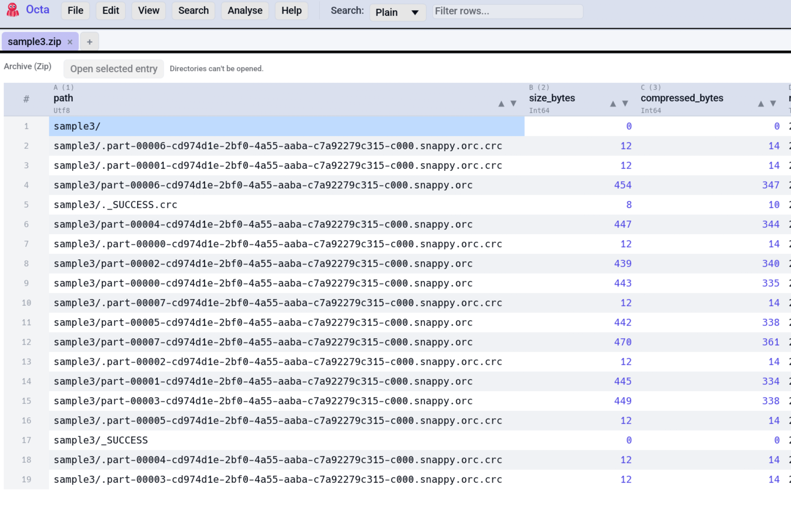

# Archive Viewer

Open `.zip`, `.tar`, and `.tgz` archives to see their contents as a
plain octa table. Read-only — extract one entry at a time into a
new tab for actual viewing.

<!-- SCREENSHOT: archive-viewer-overview.png — Archive table showing path / size / mtime columns with a "Open selected entry" action bar above. -->
{ .screenshot-placeholder }

## What gets shown

Open the archive the usual way (**File → Open** or CLI arg) and the
table renders one row per entry:

| Column             | Meaning                                                                    |
|--------------------|----------------------------------------------------------------------------|
| `path`             | The entry's path inside the archive.                                       |
| `size_bytes`       | Uncompressed size.                                                         |
| `compressed_bytes` | Compressed size — `null` for plain tar (no per-entry compression).         |
| `mtime`            | Last-modified timestamp from the entry header.                             |
| `is_dir`           | Whether the entry is a directory.                                          |
| `type`             | Coarse type hint — the entry's file extension (`csv`, `json`, …) or `dir`. |

You can sort, filter, search this table like any other.

## Opening an entry

A small **action bar** appears above the table when the current tab
is an archive:

1. Click any row to select it.
2. Press **Open selected entry**.
3. The entry is extracted into a tempfile and opened as a new tab
   via the normal file-open pipeline. Every format reader Octa knows
   about works.

The tempfile lives until the OS cleans `/tmp`. The new tab's source
path is cleared so a Save prompts for a real location.

Directory rows are skipped; the button is greyed for them.

## Supported formats

| Extension | Notes                                                               |
|-----------|---------------------------------------------------------------------|
| `.zip`    | Reads the central directory; cheap for large archives.              |
| `.tar`    | Streams the entry headers. Linear in archive size.                  |
| `.tgz`    | Same as `.tar` but with gzip on top. Use this extension; see below. |

`.tar.gz` is **not auto-routed** today. Octa's format-registry
matches on a single-component extension and can't tell `data.tar.gz`
apart from `data.csv.gz`. Rename to `.tgz` (`mv foo.tar.gz foo.tgz`)
or open via **File → Open → All files**. `.tar.bz2` and `.7z` aren't
supported yet.

## Limitations

- Read-only. There is no "add to archive" gesture.
- Tar reads scan headers sequentially; very large tars take a moment
  to list.
- The extracted entry is read entirely into memory before being
  written to the tempfile. For archives containing a single
  multi-gigabyte entry, prefer the OS's own tooling.

## See also

- [Supported Formats](../getting-started/supported-formats.md) — full
  list of file types Octa reads.
- [Tabs & Folder Sidebar](tabs-and-sidebar.md) — every extracted
  entry opens in its own tab.
