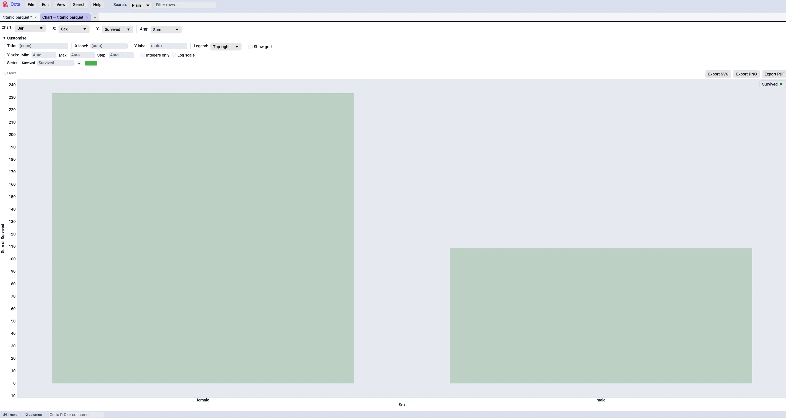

# Chart

Render the active table as an interactive chart. Charts open as their
own tabs so you can keep the source table open side-by-side and have
several charts of the same data running at once.

Trigger via:

- **Analyse → Chart** in the toolbar
- <kbd>F5</kbd>

The entry is hidden on string-only tables since there's nothing to
plot.

<!-- SCREENSHOT: chart-tab-overview.png — Chart tab with a Bar chart of
country → population, the Analyse toolbar dropdown visible, "DE / US /
JP" tick labels on the X axis, a legend in the top-right, and the
Customise collapsible expanded showing title / axis renames / per-series
controls. -->

## Chart kinds

Pick the chart kind in the leftmost combo of the control bar. Each
kind expects a specific column shape:

| Kind      | X column                  | Y column(s)         | Notes                                                                              |
|-----------|---------------------------|---------------------|------------------------------------------------------------------------------------|
| Histogram | Numeric / Date / DateTime | *(none)*            | Frequency count of X values, binned via [Sturges' rule](#histogram-bins).          |
| Bar       | Categorical (or numeric)  | One or more numeric | Groups rows by X, aggregates Y(s) via the chosen [aggregation](#bar-aggregations). |
| Line      | Numeric / Date / DateTime | One or more numeric | One polyline per Y column. Points auto-sort by X.                                  |
| Scatter   | Numeric / Date / DateTime | One or more numeric | Disconnected point cloud, one series per Y column.                                 |
| Box       | *(none)*                  | One or more numeric | Tukey 5-number summary per Y column.                                               |

## Dates on the axes

`Date` columns are internally charted as **days since 1970-01-01** and
`DateTime` columns as **seconds since the Unix epoch**, but the X-axis
**tick labels are formatted back into dates** (`YYYY-MM-DD` for
`Date`, `YYYY-MM-DD HH:MM:SS` for `DateTime`). So a histogram of a
date column shows `2024-01-01 / 2024-01-15 / 2024-02-01` on the X
axis rather than the raw `19723` / `19737` / `19754` values. The
same formatting applies to Line, Scatter, and the exported PNG /
SVG / PDF.

Supported parse formats: ISO `YYYY-MM-DD`, dotted European
`DD.MM.YYYY`, slashed European `DD/MM/YYYY`, slashed US `MM/DD/YYYY`.
For timestamps add the time component (`YYYY-MM-DD HH:MM:SS`, ISO `T`
separator, optional fractional seconds, optional trailing `Z`).

## Categorical X axes

Bar charts (always) and Line / Scatter (when X is non-numeric)
treat the X column as **categories**. Each unique value gets one
tick labelled with the category name, in first-seen order. So a
bar of `country → population` shows `DE / US / JP / ...` on the X
axis, not `0 / 1 / 2 / ...`. Box plots use the Y column names as
their X-axis labels.

There's a configurable cap on distinct categories
([`chart_max_categories`](../reference/settings.md#performance),
default 250). Above it the chart refuses to draw and shows an
inline error asking you to filter or aggregate the table first.

For Line with categorical X, points sit at category indices in
encounter order and the line connects them left-to-right. The
result has the same shape as the Bar would draw, just stroked
instead of filled.

## Bar aggregations

| Aggregation | What it does                                    |
|-------------|-------------------------------------------------|
| Sum         | Add up every Y value in the group.              |
| Avg         | Arithmetic mean of every Y value in the group.  |
| Count       | Number of rows in the group (ignores Y values). |
| Min / Max   | Smallest / largest Y value in the group.        |

## Histogram bins

Default: **Sturges' rule** (`ceil(1 + log2(n))`, clamped to `[5, 50]`).
Untick **Auto (Sturges)** to set the bin count by hand (1 to 250).

## Customise

The **Customise** collapsible exposes presentation knobs:

- **Title**: free text rendered above the plot. Empty = no title.
- **X-axis label**: overrides the column name. Empty = use the column
  name.
- **Y-axis label**: same idea.
- **Legend**: Off / Top-left / Top-right / Bottom-left / Bottom-right.
- **Grid**: tick **Show grid lines** to render the background grid;
  untick for a clean white plot area.
- **Series**: per-Y-column **Label** override (used in legend +
  tooltip) and a custom **Colour** picker (tick **Custom** to override
  the auto-cycled palette colour).

### X axis

A dedicated **X axis** sub-section under Customise, mirroring the Y axis
controls so you can clamp either dimension:

| Control       | What it does                                                                                                                                                                                                                 |
|---------------|------------------------------------------------------------------------------------------------------------------------------------------------------------------------------------------------------------------------------|
| **Min / Max** | Force fixed left / right bounds. Both must be set; a half-set range is ignored. Leave blank to auto-fit. For **Date** axes the bound is in *days since 1970-01-01*; for **DateTime** axes in *seconds since the Unix epoch*. |
| **Step**      | Custom grid step in original-data units. Empty = let `Octa` pick.                                                                                                                                                            |

Categorical Bar and Box charts treat the bounds as *category indices*
(0, 1, 2, …), so you can zoom into a slice of bars by setting Min / Max.

### Y axis

A dedicated **Y axis** sub-section under Customise:

| Control           | What it does                                                                                                                                                                                               |
|-------------------|------------------------------------------------------------------------------------------------------------------------------------------------------------------------------------------------------------|
| **Min / Max**     | Force fixed lower / upper bounds. Both must be set; a half-set range is ignored. Click **Auto** to reset.                                                                                                  |
| **Step**          | Custom grid step in original-data units. Empty = let `Octa` pick.                                                                                                                                          |
| **Integers only** | Format Y-axis ticks as whole numbers (no `.0` suffix). Useful for counts.                                                                                                                                  |
| **Log scale**     | Apply `log10(...)` to the Y values before plotting. Non-positive values drop silently. The axis label gets a `(log10)` suffix and the tick formatter renders the original magnitudes (e.g. `100`, `1000`). |

When **Min / Max** are set with log scale on, the bounds are interpreted
in original-data units and projected into log10 space internally. Type
`10` and `10000` to get the familiar three-decade range without doing
the maths.

## Sampling

Histogram, Line, and Scatter are subject to
[`chart_max_points`](../reference/settings.md#performance)
(default 100,000). Above the cap the chart evenly-spaces samples
and a pill above the plot reads `Sampled 100,000 of 5,000,000 rows`.

Bar and Box always work off the full input. Bar can afford to because
it aggregates per category anyway, and Box because the 5-number
summary is cheap regardless of row count.

Even-spaced sampling will miss outliers. The right answer is to
**filter first** and then chart, or to bump the cap if you have the
memory.

## Exporting

Three buttons sit on the right of the row above the plot:

| Button         | What you get                                                                                     |
|----------------|--------------------------------------------------------------------------------------------------|
| **Export PDF** | One-page PDF rendered from the chart's SVG via `svg2pdf`. Print-quality vector.                  |
| **Export PNG** | 2x retina-resolution PNG (1600 x 1000 pixels) rendered by `resvg` from the same SVG.             |
| **Export SVG** | The hand-emitted SVG file directly. Editable in Inkscape / Illustrator, embeddable in web pages. |

All three formats are derived from the same SVG so they look the same
regardless of window size or DPI. Title / axis labels / legend /
per-series colours carry into every export.

## Interacting with the plot

| Gesture                  | Action                         |
|--------------------------|--------------------------------|
| Drag                     | Pan.                           |
| Mouse wheel              | Zoom in / out.                 |
| Right-drag a box         | Zoom into that region.         |
| Double-click             | Reset to auto-bounds.          |
| Hover over a point / bar | Show coordinates in a tooltip. |

## See also

- [Search & Filter](search-and-filter.md) for narrowing the table
  before charting.
- [Value Frequency](value-frequency.md) gives a `value_counts()`-style
  view for a single column without leaving the table.
- [Settings → Performance](../reference/settings.md#performance) is
  where you configure `chart_max_points` and `chart_max_categories`.
