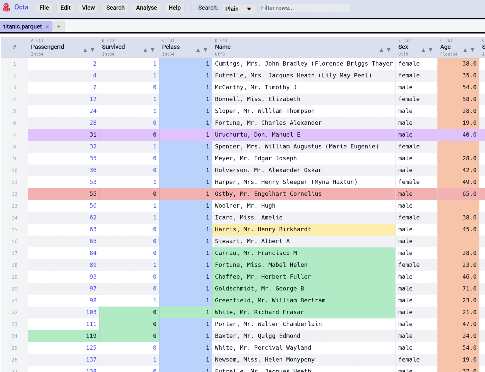

# Colour Marking

Octa lets you highlight cells, rows, and columns with colours,
useful for flagging interesting values during exploration, marking
rows that need attention, or grouping columns visually.

<!-- SCREENSHOT: colour-marking-example.png: Table with a few cells marked Yellow, an entire row marked Red, and a column marked Blue. Show how the precedence works visually. -->


## Available colours

Six colours: **Red**, **Orange**, **Yellow**, **Green**, **Blue**,
**Purple**. They're chosen to remain readable in both light and dark
themes.

## Applying a mark

### Right-click context menu

The fine-grained way, working on whatever you right-click:

- **Right-click a cell** → **Mark** → pick a colour.
- **Right-click a row number** → **Mark** → pick a colour.
- **Right-click a column header** → **Mark** → pick a colour.

If the right-clicked target is **already part of the current
selection** (multi-cell, multi-row, or multi-column), the chosen colour
is applied to every selected item, following the same precedence as
[**Ctrl+M**](#edit-menu-and-shortcut). Click outside the selection
first if you want to colour only the single right-clicked target.

### Edit menu and shortcut

**Edit → Mark** (or the
[**Mark** keyboard shortcut](../reference/shortcuts.md#marking),
default **Ctrl+M**, remappable) applies a single colour to the
**whole current selection**:

- A row block → row mark.
- A column block → column mark.
- A multi-cell selection → cell marks.
- A single cell → cell mark.

The colour used by the shortcut is set under
[**Settings → Table → Default mark colour**](../reference/settings.md#table-view)
(Green by default). Change it there if you want **Ctrl+M** to
default to Red, etc.

### Toolbar Edit menu

The **Edit → Mark** submenu lets you pick the colour explicitly
as well.

## Clearing a mark

Right-click the marked cell / row / column → **Clear Mark**.

To clear every mark on the file at once, **Edit → Clear All Marks**.

## Precedence

When the same cell is covered by overlapping marks, the precedence is:

```
cell mark > row mark > column mark
```

So a cell marked individually wins over the mark on its row, which
wins over the mark on its column. This lets you broadly highlight a
column and then override specific cells within it.

## Undo / Redo

Colour marks are tracked by [undo / redo](editing.md#undo-redo).
**Ctrl+Z** unmarks the last applied mark; **Ctrl+Y** re-applies.

## See also

- [Settings → Table → Default mark colour](../reference/settings.md#table-view)
  sets the default colour for the Mark shortcut.
- [Editing](editing.md) covers the broader edit semantics.
