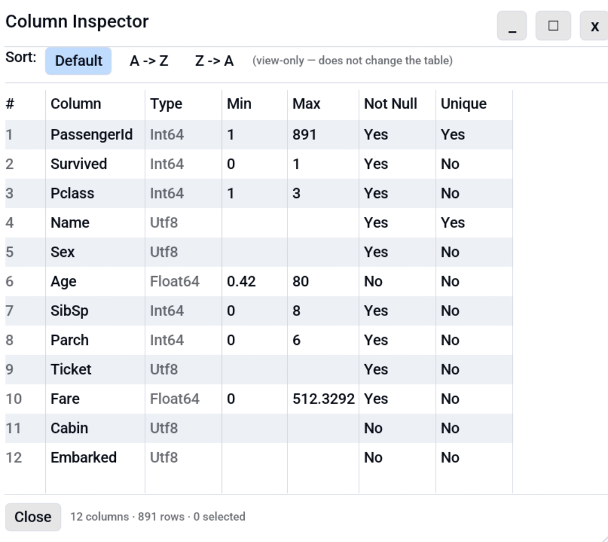

# Column Inspector

A read-only, schema-at-a-glance modal that lists every column in the
active table with its data type and a few quick statistics: numeric
min and max, whether the column contains nulls, and whether all values
are unique. Useful for sanity-checking a freshly loaded file before
running queries or edits against it.

<!-- SCREENSHOT: column-inspector-overview.png — Column Inspector dialog open over a Parquet table. Shows column name, type, min, max, nulls, all-unique columns. -->
{ .screenshot-placeholder }

## Opening the inspector

- **Keyboard shortcut**:
  [**Ctrl+I**](../reference/shortcuts.md) (remappable under
  [Settings, Shortcuts](../reference/settings.md)).
- **Menu**: **Edit, Column Inspector...**.

## Columns in the dialog

| Column            | Meaning                                                                     |
|-------------------|-----------------------------------------------------------------------------|
| **#**             | Original column index in the table.                                         |
| **Name**          | Column name as stored in the file.                                          |
| **Type**          | Octa's display type (Utf8, Int64, Float64, Date, ...).                      |
| **Min** / **Max** | Numeric min and max for numeric columns; blank otherwise.                   |
| **Nulls**         | Whether the column contains any null values or empty strings.               |
| **Unique**        | Whether every non-null value is distinct. Useful for spotting natural keys. |

Empty columns (all null) report **Unique: No** to avoid a misleading
"yes" on a column that has nothing to be unique about.

## Sorting

Inside the inspector toolbar, switch between **Default** (the original
column order), **A -> Z**, and **Z -> A**. The sort applies only to
the inspector view; it does **not** reorder columns in the underlying
table. To permanently reorder columns, drag a column header in the
main table view, or use **Edit, Sort Columns A -> Z / Z -> A**.

## Selecting and copying

- Click a row to select it.
- **Ctrl+click** adds rows to the selection;
  **Shift+click** picks a contiguous range.
- **Ctrl+A** selects every column listed.
- **Ctrl+C** copies the selected rows as TSV
  (one line per row, columns
  `#\tName\tType\tMin\tMax\tNulls\tUnique`).

## See also

- [Value Frequency](value-frequency.md) — `df.value_counts()` for one
  column at a time, including optional numeric binning. Reachable from
  the column-header right-click menu or via
  <kbd>Ctrl</kbd>+<kbd>Shift</kbd>+<kbd>I</kbd>.
