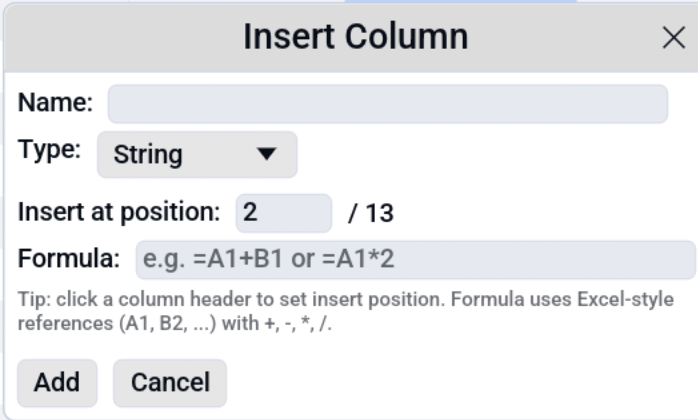

# Formulas

Octa supports a small subset of Excel-like formulas in two places:

1. **Inline in a cell**: type `=A1+B1` into any cell and the
   evaluated result replaces the formula on Enter.
2. **In the Insert Column dialog**: a formula entered there is
   treated as a row-1 template and applied to **every row** when the
   column is created.

The formula engine is intentionally simple: it covers arithmetic on
numeric cell references and literals, not the hundreds of Excel
built-in functions. For anything more complex, use the
[SQL panel](sql.md).

## Syntax

| Element         | Example             | Notes                                                                                            |
|-----------------|---------------------|--------------------------------------------------------------------------------------------------|
| Cell reference  | `A1`, `B2`, `AA17`  | Column letter (A, B, … Z, AA, AB, …) + 1-based row number. Column letters appear in each header. |
| Operators       | `+`, `-`, `*`, `/`  | Standard precedence; multiplication/division before addition/subtraction.                        |
| Parentheses     | `(A1 + B1) * 2`     | Override precedence.                                                                             |
| Numeric literal | `42`, `3.14`, `1e6` | Both integers and floats; scientific notation accepted.                                          |
| Whitespace      | `= A1 + B1`         | Ignored everywhere.                                                                              |

Formulas **must start with `=`** in cell entry; the leading `=` is
optional in the Insert Column dialog.

## Examples

```
=A1+B1              # add two columns
=(A1-B1)/B1*100     # percentage change from B1 to A1
=A1*1.05            # add 5%
=(A1+A2+A3)/3       # average of three cells
```

For Insert Column, the formula is applied per-row:

| Formula   | On row 1 | On row 5 |
|-----------|----------|----------|
| `=A1+B1`  | `A1+B1`  | `A5+B5`  |
| `=A1*1.5` | `A1*1.5` | `A5*1.5` |
| `=B1-C1`  | `B1-C1`  | `B5-C5`  |

## What gets evaluated

The engine tries to resolve each referenced cell to an `f64`:

- **Numeric columns** (Int*, Float*) are used directly.
- **String columns** are parsed via `parse::<f64>()`. The cell is
  flagged as non-numeric if parsing fails.
- **Null cells** are coerced to `0.0`.
- **Boolean / Date / DateTime / Binary / Nested** are non-numeric;
  surfaced as errors (see below).

The result is rendered as a number with `Display` precision.
Division by zero yields no value (the cell is left empty).

## When a formula can't be evaluated

If any referenced cell is non-numeric (a string that doesn't parse,
a date, a binary blob), the formula short-circuits and the row's
output is empty. For the Insert Column path, a banner appears above
the table:

> *Formula skipped N of M rows; first non-numeric reference: cell
> (row, column) → "...".*

This makes it obvious that some rows didn't get a value, and points
at the first problematic cell so you can fix the column type or
clean the data.

The error short-circuits at the **first** bad cell per row, not per
formula, so fix that one and re-evaluate to see the next one.

## Insert Column with a formula

From [**Edit → Insert Column…**](editing.md#inserting-columns):

<!-- SCREENSHOT: insert-column-formula.png: Insert Column dialog with Name, Type, Formula fields filled in (e.g. Name=margin, Type=Float64, Formula==B1-C1). -->


1. **Name**: the new column's name.
2. **Type**: pick a numeric type (Int64 / Float64) when the formula
   produces numbers.
3. **Insert at position**: 0-based index. Blank = append.
4. **Formula**: your expression. Leading `=` optional.

Click **OK** and the new column appears with every row's result.

## Limitations

- **No functions.** No `SUM(A1:A10)`, `AVG`, `IF`, `VLOOKUP`, etc.
  For aggregates and conditional logic, use
  [SQL](sql.md).
- **No range references.** `A1:A10` isn't recognised; reference cells
  individually.
- **No cross-sheet references.** Single table only.
- **No string operations.** Formulas are numeric-only.
- **No row references like `$A1` or `A$1`.** Insert Column always
  shifts both row and column on row evaluation, so write the formula
  for row 1 and it'll be applied to every row.

If your use case bumps against these, the
[SQL panel](sql.md) is almost always the right tool:
DuckDB has the full spectrum of analytical functions plus joins,
group-by, window functions, and more.

## See also

- [SQL panel](sql.md) runs DuckDB queries against the
  loaded table.
- [Editing](editing.md) covers how Insert Column dialogs work.
