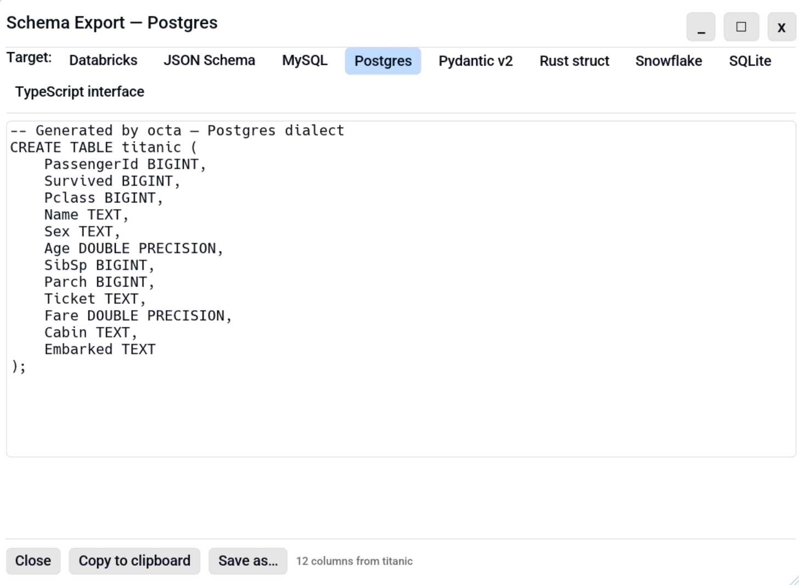

# Schema Export

Export the active table's column list. Useful for bootstrapping a database table, a Pydantic model, a
TypeScript interface, or a Rust struct from real data without
re-typing every column name.

<!-- SCREENSHOT: schema-export-overview.png: Schema Export dialog with the Postgres CREATE TABLE preview visible. -->
{ .screenshot-placeholder }

## Opening the dialog

| Path                  | Notes                                                                      |
|-----------------------|----------------------------------------------------------------------------|
| **Menu**              | **File → Export schema…** opens the dialog on the first target (Postgres). |
| **Keyboard shortcut** | <kbd>F7</kbd> (remappable under Settings → Shortcuts).                     |

The dialog renders all nine targets the same way. Switch between
them with the chip row inside the dialog. No need to pick a target
up front from a submenu.

## Supported targets

The dialog lists targets alphabetically:

| Target                   | Output                                                                                    | File extension |
|--------------------------|-------------------------------------------------------------------------------------------|----------------|
| **Databricks**           | `CREATE TABLE` with Spark SQL / Delta types (`STRING`, `TIMESTAMP_NTZ`).                  | `.sql`         |
| **JSON Schema**          | Draft 2020-12 object schema with `properties` and `required`.                             | `.json`        |
| **MySQL**                | `CREATE TABLE` with MySQL types (`UNSIGNED` / `DATETIME` / `BLOB`).                       | `.sql`         |
| **Postgres**             | `CREATE TABLE` with Postgres types.                                                       | `.sql`         |
| **Pydantic v2**          | `BaseModel` subclass with annotated fields and the correct `datetime` / `Field` imports.  | `.py`          |
| **Rust struct**          | `pub struct Foo` with `#[derive(Debug, Clone, Serialize, Deserialize)]` and chrono types. | `.rs`          |
| **Snowflake**            | `CREATE TABLE` with Snowflake types (`VARCHAR`, `TIMESTAMP_NTZ`).                         | `.sql`         |
| **SQLite**               | `CREATE TABLE` with SQLite affinity types (INTEGER/REAL/TEXT/BLOB).                       | `.sql`         |
| **TypeScript interface** | `export interface Foo { … }` with `number / string / boolean` mappings.                   | `.ts`          |

## Type mapping

Octa stores column types as Arrow-style strings (`Int64`, `Utf8`,
`Float64`, `Date32`, `Timestamp(Microsecond, None)`, …). Each target
maps them to its closest native type:

| Arrow type             | Postgres                    | MySQL                | SQLite          | Pydantic   | TypeScript              | JSON Schema                          | Rust            |
|------------------------|-----------------------------|----------------------|-----------------|------------|-------------------------|--------------------------------------|-----------------|
| `Int8 / Int16`         | `SMALLINT`                  | `TINYINT / SMALLINT` | `INTEGER`       | `int`      | `number`                | `integer`                            | `i8 / i16`      |
| `Int32`                | `INTEGER`                   | `INT`                | `INTEGER`       | `int`      | `number`                | `integer`                            | `i32`           |
| `Int64`                | `BIGINT`                    | `BIGINT`             | `INTEGER`       | `int`      | `number`                | `integer`                            | `i64`           |
| `UInt8 … UInt32`       | widened up one              | `UNSIGNED` variants  | `INTEGER`       | `int`      | `number`                | `integer`                            | `u8 … u32`      |
| `UInt64`               | `NUMERIC(20, 0)` *          | `BIGINT UNSIGNED`    | `INTEGER`       | `int`      | `number`                | `integer`                            | `u64`           |
| `Float16 / Float32`    | `REAL`                      | `FLOAT`              | `REAL`          | `float`    | `number`                | `number`                             | `f32`           |
| `Float64`              | `DOUBLE PRECISION`          | `DOUBLE`             | `REAL`          | `float`    | `number`                | `number`                             | `f64`           |
| `Boolean`              | `BOOLEAN`                   | `BOOLEAN`            | `INTEGER` (0/1) | `bool`     | `boolean`               | `boolean`                            | `bool`          |
| `Utf8 / LargeUtf8`     | `TEXT`                      | `TEXT`               | `TEXT`          | `str`      | `string`                | `string`                             | `String`        |
| `Date32 / Date64`      | `DATE`                      | `DATE`               | `TEXT`          | `date`     | `string` (ISO date)     | `string` + `format: date`            | `NaiveDate`     |
| `Timestamp(…)`         | `TIMESTAMP` / `TIMESTAMPTZ` | `DATETIME`           | `TEXT`          | `datetime` | `string` (ISO datetime) | `string` + `format: date-time`       | `NaiveDateTime` |
| `Binary / LargeBinary` | `BYTEA`                     | `BLOB` / `LONGBLOB`  | `BLOB`          | `bytes`    | `string` (base64)       | `string` + `contentEncoding: base64` | `Vec<u8>`       |

`*` Postgres has no unsigned integer; UInt64 round-trips as `NUMERIC(20, 0)` with a `/* … */` note.

The two cloud-warehouse SQL dialects map types as follows:

| Arrow type             | Databricks                    | Snowflake                        |
|------------------------|-------------------------------|----------------------------------|
| `Int8 / Int16`         | `TINYINT / SMALLINT`          | `TINYINT / SMALLINT`             |
| `Int32`                | `INT`                         | `INTEGER`                        |
| `Int64`                | `BIGINT`                      | `BIGINT`                         |
| `UInt8 … UInt32`       | widened up one                | widened up one                   |
| `UInt64`               | `DECIMAL(20, 0)` *            | `NUMBER(20, 0)` *                |
| `Float16 / Float32`    | `FLOAT`                       | `FLOAT`                          |
| `Float64`              | `DOUBLE`                      | `FLOAT` (64-bit)                 |
| `Boolean`              | `BOOLEAN`                     | `BOOLEAN`                        |
| `Utf8 / LargeUtf8`     | `STRING`                      | `VARCHAR`                        |
| `Date32 / Date64`      | `DATE`                        | `DATE`                           |
| `Timestamp(…)`         | `TIMESTAMP_NTZ` / `TIMESTAMP` | `TIMESTAMP_NTZ` / `TIMESTAMP_TZ` |
| `Binary / LargeBinary` | `BINARY`                      | `BINARY`                         |

`*` Neither dialect has unsigned integers; UInt64 round-trips as a
20-digit decimal with a `/* … */` note. The two `Timestamp` mappings
are the tz-less Arrow timestamp vs. the tz-aware one.

Arrow types that fall outside the table above (e.g. `Decimal256`,
`List<…>`) fall through to each target's TEXT-equivalent with a
`/* unknown Arrow type "…" */` (or language-appropriate) comment so
the output is never silently wrong.

## Identifier handling

Column names with spaces, hyphens, or leading digits would make invalid identifiers in most targets. Schema Export sanitises:

- **SQL DDL**: identifiers are emitted bare when they're already
  valid. A name with spaces, punctuation, or a leading digit is quoted
  (`"name"` for Postgres / SQLite / Snowflake, `` `name` `` for MySQL /
  Databricks), with embedded quotes doubled.
- **Pydantic**: invalid identifier names get `_` substitution +
  `Field(..., alias="<original>")` so JSON round-trip preserves the
  source key.
- **TypeScript**: invalid keys are wrapped in `"…"`, which is valid TS for
  object properties.
- **JSON Schema**: keys are passed through verbatim (JSON allows any
  string).
- **Rust**: invalid names get `_` substitution + `#[serde(rename =
  "<original>")]`.

The table-level identifier (used for `CREATE TABLE`, the class /
interface / struct name) comes from the source file's stem (or
`data` for an unsaved tab) and is PascalCased for class targets.

## Copying and saving

- **Copy to clipboard** drops the rendered text on the clipboard
  ready to paste into a `psql`, an editor, or a code review.
- **Save as…** opens the system file picker pre-filled with
  `<source_name>_schema.<ext>`.

The active row filter does **not** affect schema export. A table with 10M rows and an active filter
exports the same DDL as the same table with zero filter.

## See also

- [`octa --export-schema`](../cli/export-schema.md): the same feature
  from the command line.
- [MCP `export_schema` tool](../mcp/tools/export_schema.md): the same
  renderers over MCP, with multi-table support.
- [Column Inspector](column-inspector.md): see types and basic
  stats without leaving Octa.
- [Saving](saving.md): for writing back to the same DB.
