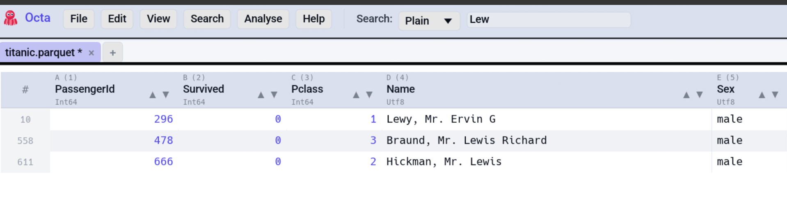
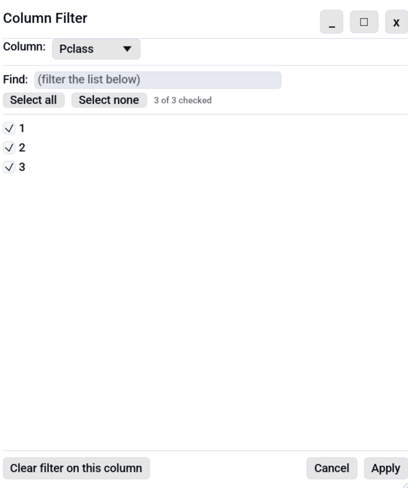
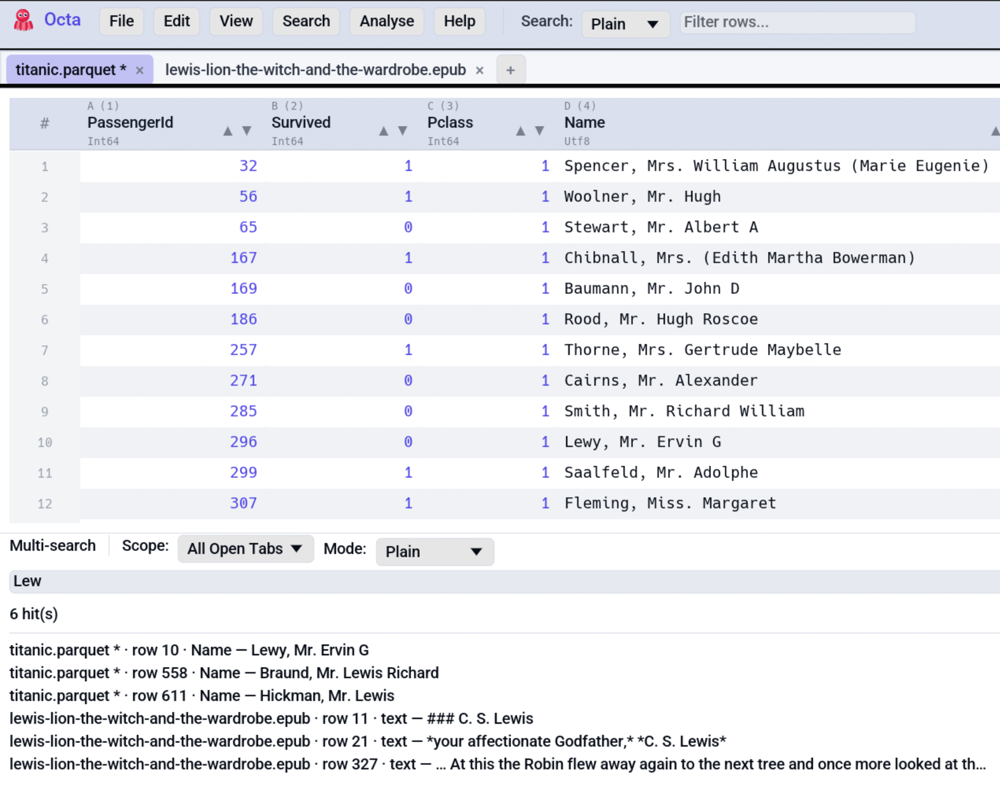

# Search & Filter

Octa's search filters the table in real time, so only rows containing
a match stay visible. The same field doubles as the entry point for
**Find & Replace**.

<!-- SCREENSHOT: search-toolbar.png — Toolbar with the search box focused, a few characters typed, mode dropdown visible (Plain/Wildcard/Regex), table below showing filtered results. -->


## Quick start

1. Press **Ctrl+F**
   ([`FocusSearch`](../reference/shortcuts.md#search)), or click
   the search box in the toolbar.
2. Type. The table re-filters on every keystroke.
3. **Escape** clears the search.

The status bar shows the visible row count vs. the total, which is
handy for *"how many rows match `error`?"* without writing SQL.

## Search modes

A dropdown next to the search box switches between three modes:

=== "Plain"

    **Case-insensitive substring match**, the default. `foo` matches
    `Foo`, `bar foo baz`, `foobar`, etc.

    Plain mode is the fastest of the three. Use it for everyday
    "find rows containing this word" queries.

=== "Wildcard"

    `*` matches any sequence of characters (including empty), `?`
    matches exactly one character. Escape with `\*` and `\?` for
    literal asterisks / question marks.

    Examples:

    | Pattern          | Matches                                |
    |------------------|----------------------------------------|
    | `user_*`         | `user_id`, `user_name`, `user_2024_01` |
    | `report-????-Q1` | `report-2024-Q1`, `report-2025-Q1`     |
    | `*.log`          | anything ending in `.log`              |

=== "Regex"

    Full [regex crate](https://docs.rs/regex/) syntax. Case-sensitive
    unless you prefix with `(?i)`.

    Examples:

    | Pattern             | Matches                                     |
    |---------------------|---------------------------------------------|
    | `^foo`              | rows starting with `foo`                    |
    | `\d{4}-\d{2}-\d{2}` | ISO-formatted dates                         |
    | `(?i)error\|warn`   | rows containing `error` or `warn`, any case |

    Compilation happens once per keystroke; invalid patterns leave
    the table un-filtered and show a tooltip with the error.

The default mode is set under
[**Settings → Search & Editor → Default search mode**](../reference/settings.md#search-editor).

## What the search matches against

Every column's textual value, joined into one string per row. This
means:

- Numeric columns search against their displayed form (`42` matches
  `"42"`).
- Date columns search against the ISO display (`2024-01-15`); see
  [Date Inference](../reference/date-inference.md) for how text
  formats get promoted.
- Boolean columns search against `"true"` / `"false"`.
- Binary columns search against whichever display mode is active
  (Hex / Binary / UTF-8; configured under
  [**Settings → Table View**](../reference/settings.md#table-view)).

For column-scoped value filtering, see the
[Column Filter](#column-filter) section below. For typed range or
expression filtering, use the [SQL panel](sql.md):
`SELECT * FROM data WHERE col >= 42` is column-aware in a way the
toolbar text filter isn't.

## Find & Replace

**Ctrl+H**
([`ToggleFindReplace`](../reference/shortcuts.md#search)) opens the
replace bar above the table. Two buttons:

- **Next** replaces the first match.
- **All** replaces every match across the **currently-visible** rows
  (i.e. the filtered set, if a search is active).

The replace text supports the same modes as the search, including
regex backreferences (`$1`, `$2`, …) when the search mode is Regex.

**Escape** closes the replace bar.

!!! note "Filtered vs. all rows"

    **Replace All** only touches rows visible after filtering. To
    replace across the whole table, clear the search first.

## Find duplicates

A search-shaped answer to *"which rows repeat?"*. Lives in the same
menu as the toolbar search since the workflow is the same: pick what
counts as a match, then look at the result.

**Search → Find duplicates…** or
<kbd>Ctrl</kbd>+<kbd>Shift</kbd>+<kbd>D</kbd>
([`FindDuplicates`](../reference/shortcuts.md#search))
opens a dialog with a column checklist and two output modes:

| Output mode                    | Effect                                                                                                                               |
|--------------------------------|--------------------------------------------------------------------------------------------------------------------------------------|
| **Highlight rows in place**    | Every duplicate row gets an orange row mark in the active tab. Wipe them in one step with **Edit → Mark → Clear all marks**.         |
| **Open duplicates in new tab** | Clones the column list and only the duplicate rows into a fresh scratch tab. The source tab keeps its data; Save prompts a new path. |

Two rows count as duplicates when every ticked column has the same
displayed text. The key seeds itself from the current column or cell
selection, so the common one column dedupe is two keys away:
<kbd>Ctrl</kbd>+<kbd>Shift</kbd>+<kbd>D</kbd> → <kbd>Apply</kbd>.

The canonical write up, including the displayed text equality rule
that keeps `Int(1)` apart from `Float(1.0)` and the empty result
status bar message, lives on the
[Editing page](editing.md#find-duplicates).

## Column Filter

Excel-style per-column value-set filter. Pick a column, see its
unique values as checkboxes, uncheck the ones to hide. Multiple
columns can be filtered at once; column filters AND with each other
and with the text search above.

<!-- SCREENSHOT: column-filter-dialog.png — Column Filter dialog open over a table. Column combo, "Find" textbox, scrollable checkbox list with a few values unchecked, "Apply" / "Cancel" / "Clear filter on this column" buttons. -->


### Three ways to open it

1. **Search → Column Filter...** in the toolbar.
2. The
   [**Open column filter** shortcut](../reference/shortcuts.md)
   (default **Ctrl+Shift+F**, remappable).
3. **Right-click any column header → Filter values...** opens the
   dialog pre-seeded on that column.

A status-bar **Filter** chip also appears whenever at least one
column has an active filter; clicking it opens the dialog on the
first filtered column.

### Using the dialog

- The top combo picks the column being edited. Switching columns
  commits the in-progress draft to the previous column automatically,
  so you can chain edits without re-opening the dialog.
- **Find** narrows the value list when a column has many unique
  values. Up to 5000 values render at once; a footer hint tells you
  how many more are hidden.
- **Select all** / **Select none** operate on the currently visible
  subset (post-search), not the whole list.
- **Apply** commits the draft. "All checked" and "none checked" are
  both interpreted as "no filter on this column".
- **Clear filter on this column** removes the column's filter
  entirely.
- **Cancel** discards the in-progress draft.

### How filters interact

- Filtered columns get a small accent-colored dot next to the column
  name in the header.
- Filters live with the tab. Closing the tab discards them; they are
  not saved to disk.

!!! note "Select none"

    Unchecking every value with **Select none** + **Apply** hides
    every row in that column. Use **Clear filter on this column** to
    remove the filter entirely.

### Saving filtered data

When a filter is active, **File → Save As** writes only the
**currently visible** rows. The output file is a one-shot snapshot of
the view; the in-memory table keeps the full dataset so you can keep
working with it. The status bar message confirms the export:
*"Exported N filtered rows to {file}"*.

Regular **File → Save** always writes the full table back to the
source path, ignoring active filters. This keeps the source file safe
from accidental data loss while you have filters on.

## Multi-search

The toolbar **Search** field is per-tab. Sometimes you want the
opposite — find the same string everywhere at once. **Search →
Multi-search…** (default <kbd>F6</kbd>, remappable) opens a docked
panel at the bottom of the window with its own query box, mode
picker, and a scope selector:

| Scope             | What gets searched                                                         |
|-------------------|----------------------------------------------------------------------------|
| **All Open Tabs** | Every loaded tab — synchronously, no background thread. Cheap and instant. |
| **Directory**     | Every readable file in a picked directory (top level only, not recursive). |

<!-- SCREENSHOT: multi-search-panel.png — Multi-search panel docked at the bottom showing scope=Directory, a query, a "Scanning 12/47 files" progress label, and a few result rows. -->
{ .screenshot-placeholder }

### Running a search

1. Open the panel (**Search → Multi-search…** or <kbd>F6</kbd>).
2. Pick a scope. Directory scope also asks for a folder via the
   **Pick directory…** button — the path you pick is remembered for
   subsequent searches in the same session.
3. Type a query. Plain / Wildcard / Regex modes are the same as the
   main search bar.
4. Press <kbd>Enter</kbd> or click **Search**.

The result list shows one entry per matching cell, formatted as:

```
<source> · row N · <column name> — <snippet>
```

`<source>` is the tab title for open-tab hits, the file name for
directory hits. Clicking any result jumps straight to that cell — if
a directory result points at a file that isn't open yet, Octa opens
it as a fresh tab first.

### Limits and skips

- **Per-file size cap.** Files larger than
  [`grep_max_file_size_mb`](../reference/settings.md#performance)
  (default 50 MB) are skipped during the directory scan and
  appear in the **N file(s) skipped** chip with the actual size.
  Set the cap to `0` to disable.
- **Unparseable files.** When a reader fails on a specific file
  (binary blob, malformed text, encoding mismatch, …) Octa moves on
  to the next file and adds the failing one to the same skipped
  chip with the reader's error message. Other files still produce
  results.
- **Result cap.** A single scan returns at most **10,000** hits; the
  panel surfaces a `(capped at …)` chip when that happens. Per file
  is capped at **1,000** so one runaway file can't crowd out
  everything else.
- **Non-recursive.** Directory scope walks one level. Hidden files
  (leading `.`) and subdirectories are skipped. Open the
  subdirectory in the sidebar (or pick it here) to scope into it.
- **In-memory rows only.** For lazy formats (Parquet, CSV/TSV) the
  scan covers whatever's currently loaded; rows still streaming in
  the background aren't searched until they land. For directory
  scope, each file is loaded via the same readers Octa would use
  to open it normally, so binary formats (SQLite, DuckDB, Parquet,
  …) work, they just take longer.

### Reviewing skipped files

The **N file(s) skipped — click to expand** chip appears above the
result list whenever any file in the directory scope was skipped.
Expanding it lists every skipped file with its reason, either
*"X MB exceeds Y MB cap"* or the parser's error message, and the
full absolute path on hover. The list resets on the next search.

The **Cancel** button stops a running directory scan at the next
file boundary. The panel keeps whatever hits were collected before
the cancel.

## Clearing the search

Three ways:

- Click the **×** in the search box.
- Press **Escape** while the search box is focused.
- Clear all text manually.

The full-row count returns to its un-filtered value in the status
bar.

## See also

- [SQL panel](sql.md) offers column- and type-aware
  filtering via DuckDB.
- [Settings reference](../reference/settings.md#search-editor) lets
  you pick a default search mode that survives across sessions.
- [Find duplicates](editing.md#find-duplicates) on the Editing page
  is the full reference for the duplicate finder summarised above.
