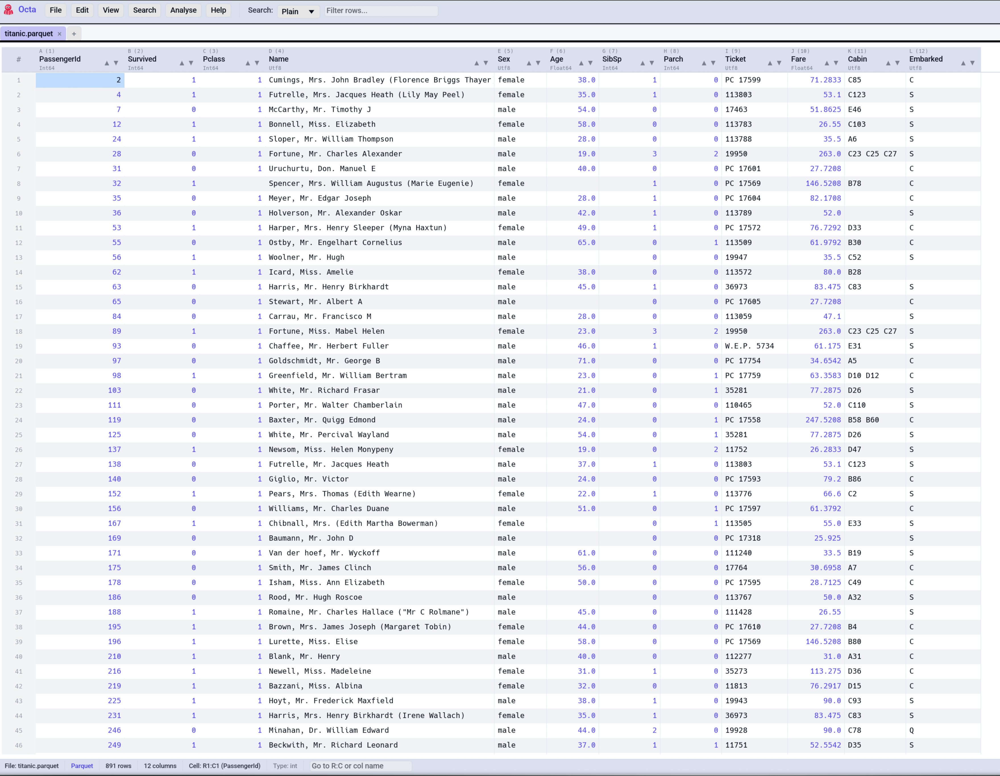

# Table View

The Table view is Octa's default for almost every format: Parquet,
CSV, SQLite, Excel, you name it. It's a spreadsheet-like virtual
renderer that streams large files smoothly and supports inline
editing, multi-cell selection, sorting, filtering, and clipboard
operations.

<!-- SCREENSHOT: table-view-overview.png — Octa main window in Table view. Show a file with maybe 8-10 columns, a few rows highlighted (selection), a sort indicator on one column. Light theme. -->

## Navigation

- **Arrow keys** move the selected cell.
- **Scroll wheel** scrolls vertically. **Shift+Scroll wheel** scrolls
  horizontally.
- **Ctrl+Shift+Up / Down** jumps the selection to the first / last
  row of the column.
- **Ctrl+Shift+Left / Right** jumps to the first / last column.
- **Ctrl+G** ([`GoToCell`](../reference/shortcuts.md#navigation-in-the-table))
  focuses the navigation field in the status bar. Type `R5:C3` to
  jump to a cell, `R5` to jump to a row, `C3` for a column, or a
  column name (e.g. `created_at`) to jump to that column's first
  cell.

## Selection

- Click a **cell** to select just that cell.
- Click a **row number** (grey column on the left) to select the
  entire row. **Ctrl+click** adds rows to the selection;
  **Shift+click** picks a contiguous range.
- Click a **column header** to select the entire column. The same
  Ctrl / Shift modifiers extend / range-select columns.
- **Ctrl+A** selects all rows (when no text editor is focused).
- **Ctrl+Up / Down** (and **Ctrl+Left / Right**) extend the
  selection by one row/column from the current anchor.

The active selection drives clipboard operations:
[**Ctrl+C**](../reference/shortcuts.md#clipboard) copies whatever
is selected (single cell, multi-row block, multi-column block, or
a free multi-cell selection) as tab-separated values.

## Sorting

Click a column header to sort by that column **ascending**. Click
again for **descending**. Click a third time to clear the sort.

The sort indicator (▲ / ▼) appears next to the column name. Sorting
is applied to the **filtered** view, so searching first and then
sorting works as you'd expect.

## Resizing columns

- **Drag the right edge** of a column header to resize it. Minimum
  width is 60 px; no upper limit.
- **Double-click the seam** between two column headers to auto-fit
  the left column to its widest visible value (header included).
- **Ctrl+Shift+W** (remappable) fits **every** column to its content.

Best-fit measures up to 5,000 sample rows so it stays snappy on
multi-million-row tables.

## Reordering columns

**Drag a column header** sideways to reorder. The cursor changes to
a hand when you're over a draggable region; a drop indicator shows
where the column will land.

To rename a column, **double-click its header**. **Right-click** a
header for the data-type submenu (Int64 / Float64 / Utf8 / etc.),
which re-types the column in place, with values that can't convert
becoming nulls.

## Editing cells

**Double-click** a cell to enter edit mode. The current text is
selected so you can type to replace, or click to position the
cursor. Confirm with **Tab** / **Enter**; cancel with **Escape**.
Values parse based on the column's declared type:

- Numeric columns reject non-numeric input.
- Date columns parse ISO-8601 and most common dialects (see
  [Date Inference](../reference/date-inference.md)).
- Binary columns parse according to the active display mode
  (Binary / Hex / Text); see
  [**Settings → Table View → Binary display mode**](../reference/settings.md#table-view).

For a non-trivial number of edits, see the dedicated
[Editing page](editing.md) which covers row/column structural
operations, undo / redo, and the edit overlay.

## Lazy row loading (large files)

For streaming formats (Parquet, CSV, TSV), Octa loads the first
**5,000,000 rows** at open and keeps loading the rest in the
background as you scroll. The status bar shows a busy spinner during
background load.

The 5 M default is the **initial-load row cap**, configurable under
[**Settings → Performance → Initial-load row cap**](../reference/settings.md#performance).
Raising it improves first-paint completeness on giant files at the
cost of more memory; lowering it makes the initial open faster. Tick
the **Unlimited** checkbox next to the input to load every row up
front (recommended only when you have RAM to spare).

Parquet files with very many row groups (> 32,767) fall back to a
DuckDB-backed reader automatically, so they open without manual
recompaction.

Files smaller than the cap load entirely on first open, with no
streaming.

## Read-only mode

**F8** ([`ToggleReadOnly`](../reference/shortcuts.md#view)) toggles
a session-only read-only mode that disables every editing path
(cell edits, structural changes, marks, undo/redo,
[raw text editor](view-modes/raw-text.md)). Useful when you're
poking around a file you don't want to accidentally modify. The
status bar shows a `[Read-only]` pill when active.

A one-shot notice explains the mode the first time you toggle it;
suppress with
[**Settings → File-Specific → Read-only mode notice**](../reference/settings.md#file-specific).

## Right-click context menu

Right-click anywhere on the table for context-aware actions:

- **On a cell**: Copy, [Mark](colour-marking.md), Parse in new tab,
  Insert / Delete row / column, etc.
- **On a row number**: Copy row, [Mark row](colour-marking.md),
  Delete row, Insert row, Move row.
- **On a column header**: Copy column,
  [Mark column](colour-marking.md), Rename, Change Type, Delete
  column, Move column, **Hide column**, **Copy column name(s)**,
  [Filter values...](search-and-filter.md#column-filter).

## Selection stats

Selecting more than one cell adds a pill to the right side of the
status bar summarising the selection:

- For numeric selections: **Count**, **Sum**, **Avg**, **Min**, **Max**.
- For mixed or non-numeric selections: just **Count**.

The selection sources fall through in the same order Ctrl+C uses:
multi-cell (Ctrl+Arrow) first, then row selections, then column
selections. A single-cell selection keeps the existing Cell / Type
info pill instead.

## Hide and show columns

Right-click any column header and pick **Hide column** to drop it
from the view. Hidden columns are still part of the underlying
table on disk: both **Save** and **Save As** write them out
unchanged. Pull them back via **Edit → Show hidden columns** (the
menu entry is greyed when nothing is hidden).

Hidden state is **per tab and session-only** — closing the tab or
reopening the file clears the hidden set. Use it as a
viewport-management tool, not a schema modification.

## Copy column name(s)

Right-click any column header and pick **Copy column name(s)** to
copy the header text to the clipboard. If you have multiple
columns selected (Ctrl-click their headers) and right-click one of
them, all selected names are joined with newlines. Useful for
constructing SQL `SELECT` lists or scripts from the columns Octa
sees.

## Pinned tabs

Right-click any file-backed tab in the tab strip and pick **Pin
tab**. Pinned tabs:

- Show a 📌 prefix in the tab label.
- Hide the small × close button.
- Refuse to close on Ctrl+W or the unsaved-changes prompt — you
  have to unpin them first (same right-click menu).

### Persistence across restarts

Pinned tab paths are saved to
`settings.toml`'s [`pinned_tabs`](../reference/settings.md#files)
field and reopened on next launch. Files that no longer exist on
disk are silently dropped from the list. Scratch tabs (no source
path) cannot be pinned; the menu entry is greyed out for them.

!!! warning "Unsaved changes in pinned tabs are NOT auto-saved"

    Pinning does **not** change save semantics. Closing the
    application or closing the tab with unsaved changes still runs
    the standard Save / Don't Save / Cancel dialog. The pinned tab
    reopens on next launch with whatever is on disk — any unsaved
    edits from the previous session are lost if you didn't save
    them. Save with **Ctrl+S** (or **Save As**) before quitting.

## See also

- [Search & Filter](search-and-filter.md) narrows the table to rows
  that match a pattern.
- [Editing](editing.md) covers structural row/column operations plus
  undo semantics.
- [Colour Marking](colour-marking.md) highlights cells, rows, and
  columns.
- [Saving](saving.md) writes back to disk, with format-specific
  notes for databases.
