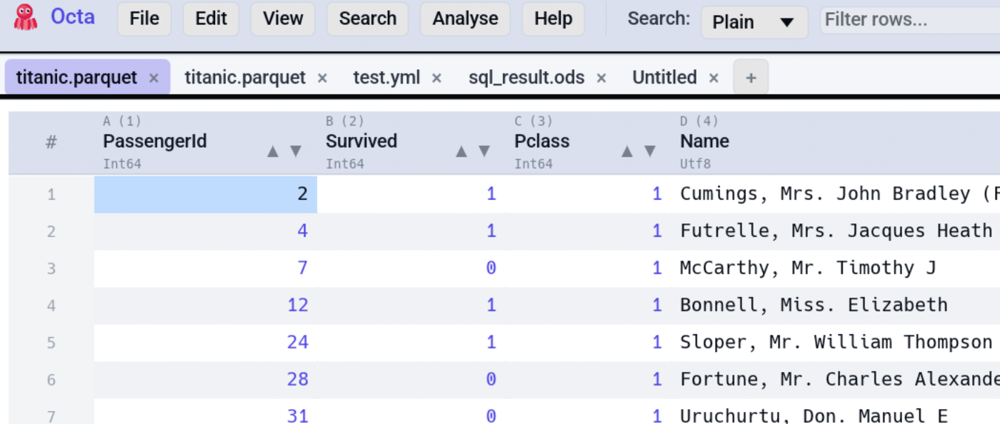
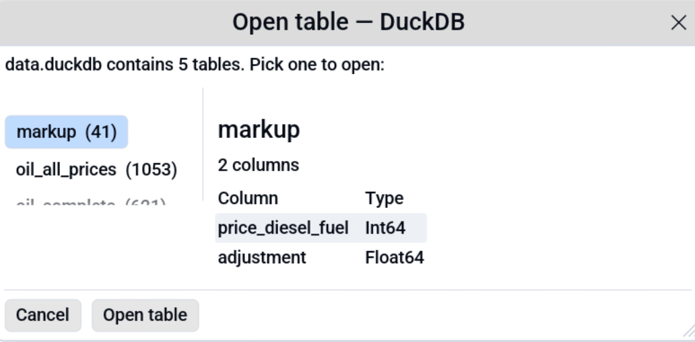

# Tabs & Folder Sidebar

Octa is multi-tab from the ground up. Every file you open lives in
its own tab; the same file opened twice gets two independent tabs
with independent edit overlays.

<!-- SCREENSHOT: tabs-and-sidebar.png: Window with the folder sidebar docked on the left, expanded down a few levels, and several tabs open in the strip across the top. -->

## The tab strip

A row of tabs sits under the toolbar and is rendered every frame,
even when only one tab is open. Each tab shows the filename and an
`*` suffix when there are unsaved changes.

### Tab controls

- **Left-click** a tab to activate it.
- **Hover** a tab to see its full file path in a tooltip, useful
  when several tabs share a filename.
- **Right-click** a tab for the context menu:
  - Pin tab
  - Compare with active tab
- **Ctrl-click** a non-active tab to add it to a multi-selection
  set (visualised as a soft accent tint). Currently used by the
  [Compare view](view-modes/compare.md)'s "Compare selected tabs"
  shortcut.

### Reopening a closed tab

**Ctrl+Shift+T**
([`ReopenLastClosedTab`](../reference/shortcuts.md#file-operations)) re-opens the most recently closed tab. Octa
remembers the last 10 closed tabs, so pressing the shortcut
repeatedly walks back through them in reverse close order.

Tabs backed by a file on disk re-load from the file (so any
external changes are picked up). Scratch tabs (no source path,
e.g. "parsed in new tab" results or raw edits) re-create the
visible state verbatim from the snapshot Octa kept.

The Edit menu surfaces **Reopen Last Closed Tab** with the binding
shown when at least one closed-tab snapshot exists.

## Multi-file open

Two ways to open multiple files at once:

1. **From the file picker**: **File → Open** uses
   `rfd::FileDialog::pick_files()` (plural), so Ctrl-click or
   Shift-click in the dialog to select several. Each opens in a new
   tab.
2. **From the [command line](../cli/index.md)**: `octa file1.csv
   file2.parquet file3.json` has the same effect.

The first file replaces an empty welcome tab if one is active;
subsequent files open in fresh tabs. The active tab follows the
most-recently-loaded file.

If a file has a multi-table source (SQLite, DuckDB, GeoPackage), the
[table picker dialog](../getting-started/supported-formats.md#multi-table-files)
appears before the file loads. The multi-file open queue pauses
while the picker is up; pick a table, and the next queued file
proceeds.

## The folder sidebar

**File → Open Directory…** opens a directory picker and installs a
sidebar showing the folder's tree. It's an `egui::SidePanel` docked
on the **left** by default; switch to the right under
[**Settings → Directory Tree → Sidebar position**](../reference/settings.md#directory-tree).

The sidebar takes 50% of the window width on first open; drag the
splitter to resize.

### Sidebar behaviour

- **Click a directory row** to expand / collapse it.
- **Click a file row** to open the file in a new tab (or replace the
  empty welcome tab).
- Directories sort **before** files, case-insensitive.
- Hidden entries (`.git`, `.DS_Store`, etc.) are skipped.
- Long filenames are truncated with an ellipsis, so the row never
  exceeds the panel width.
- **Right-click a file row** for the context menu:
  - Open
  - Copy name (basename only)

### Closing the sidebar

**File → Close Directory** hides the sidebar without touching any of
the tabs you've already opened from it. Re-opening a folder shows it
again.

## Multi-table databases (table picker)

When you open a `.sqlite` / `.duckdb` / `.gpkg` file with **more than
one user table**, Octa shows a modal table picker before the data
loads:

<!-- SCREENSHOT: table-picker.png: Modal dialog listing tables in a database, with table name, row count, and a schema preview for the highlighted one. -->
{ .screenshot-placeholder }

- Click a table to select it; the right pane previews the schema.
- Click **Open** to load it in a new tab.
- Click **Cancel** to back out of the file open.

The dialog opens at a fit-to-content height: with a handful of tables
it stays compact, with many it caps at a configurable number of visible
rows and the list scrolls. Drag the bottom-right corner to grow it
whenever you want to see more tables at once. The cap lives in
**[Settings → Performance → Tables visible in picker](../reference/settings.md#performance)**
(default 10).

Single-table databases auto-load without the picker. Empty databases
fall through to the standard reader (which returns a clear
"empty file" error).

To re-show the picker for a database that's already open, close the
tab and reopen the file.

## See also

- [Compare view](view-modes/compare.md) uses tab multi-selection
  (Ctrl+click) to pick the right-side file.
- [Settings → Directory Tree](../reference/settings.md#directory-tree)
  changes the sidebar dock side.
- [Settings → Files](../reference/settings.md#files) changes the
  number of recent files remembered.
