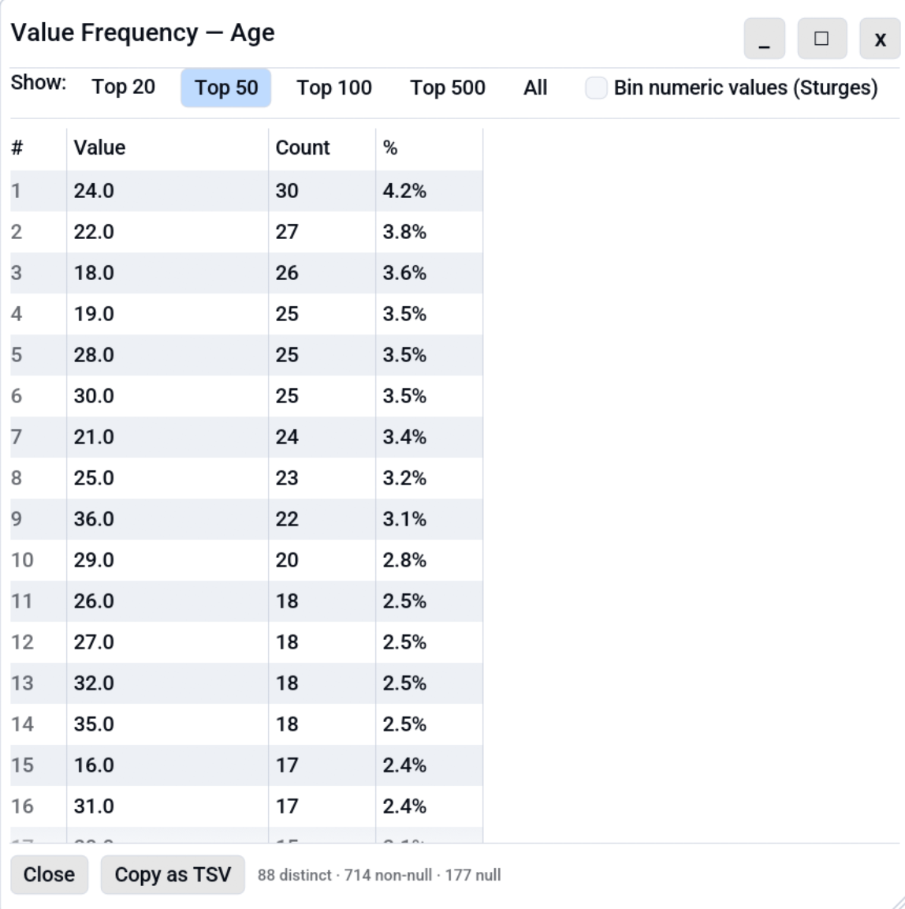

# Value Frequency

The Value Frequency dialog answers "what are the most common values in
this column?". It is a one-click equivalent of pandas'
`df['x'].value_counts()` for the active table.

<!-- SCREENSHOT: value-frequency-overview.png: Value Frequency dialog showing top 50 values in a categorical column with counts and percentages. -->


## Opening the dialog

| Path                          | Notes                                                                                                                                                   |
|-------------------------------|---------------------------------------------------------------------------------------------------------------------------------------------------------|
| **Right-click column header** | "Value frequency…" entry in the column-header context menu.                                                                                             |
| **Analyse menu**              | **Analyse → Value frequency…** opens a column picker first (the menu has no column context), then the dialog for the chosen column.                     |
| **Keyboard shortcut**         | <kbd>Ctrl</kbd>+<kbd>Shift</kbd>+<kbd>I</kbd> Targets the column of the currently selected cell. With no cell selected it opens the same column picker. |

## What it shows

Three columns per row:

| Column    | Meaning                                                                |
|-----------|------------------------------------------------------------------------|
| **Value** | The distinct cell value (or the range, if numeric binning is enabled). |
| **Count** | How many rows have this value (or fall in this bin).                   |
| **%**     | `count / total_non_null * 100`, to one decimal place.                  |

For raw value counts, rows are sorted by **Count** descending; ties
broken alphabetically by **Value** for a deterministic ordering. (When
[numeric binning](#numeric-binning-histogram) is on, rows are instead
shown in ascending range order.) The footer reports total distinct
values, total non-null cells, and the null count for the column.

## Top-N presets

| Preset                                              | Effect                                                                      |
|-----------------------------------------------------|-----------------------------------------------------------------------------|
| **Top 20** / **Top 50** / **Top 100** / **Top 500** | Show the N most common values. Default is **Top 50**.                       |
| **All**                                             | Show every distinct value. Watch the row count on high-cardinality columns. |

The selected preset persists per tab, so reopening the dialog on the
same tab remembers your choice. Top-N applies to **raw value counts
only** and is hidden while numeric binning is on, where the bin count
controls how many rows you get.

## Numeric binning (histogram)

For numeric columns (`Int*`, `Float*`), check **Bin numeric values**
to build a **histogram**: instead of counting each raw value, Octa
takes the column's range `[min, max]`, splits it into **N equal-width
ranges**, and counts how many rows fall into each.

```
width = (max - min) / N
```

Type a number into the **Bins:** field to set **N** (clamped to
`[1, 1000]`); leave it empty for an automatic count via Sturges' rule
(`ceil(1 + log2(n))`, clamped to `[5, 30]`).

What you see:

- **N bins means N rows.** Every range is shown in ascending order,
  **including empty ones** (count `0`), so the row count is always the
  bin count you asked for and the distribution's shape is visible.
- Range labels are `[lo, hi)` half-open intervals (`lo` included, `hi`
  excluded) so each row counts in exactly one bin; the **last** bin is
  closed `[lo, hi]` so the maximum value has a home.
- The **Count** column is how many rows fall in that range; tall counts
  mark where your data clusters.
- When every value in the column is identical there's no range to split,
  so you get a single bucket.

Because the bin count is the control while binning, the **Top-N**
presets (Top 20 / 50 / … / All) are hidden; they apply only to raw
value counts. Non-finite values (`NaN`, `±Inf`) and accidental
non-numeric cells in a numeric column appear as separate rows after the
bins, useful for catching type drift.

The checkbox is hidden for non-numeric columns. Untick it to go back to
exact per-value counts.

## Acting on a frequency row

Right-click any row (when binning is off) to get:

- **Copy value** puts the raw value on the clipboard.
- **Filter table to this value** adds a column filter restricting the
  active table to rows where this column equals the picked value. The
  Excel-style column-filter chip appears in the status bar; see
  [Column Filter](search-and-filter.md#column-filter) to clear it.

## Copy as TSV

The **Copy as TSV** button at the bottom puts the entire visible table
on the clipboard as three tab-separated columns: `<column>`, `count`,
`percent`. Useful for pasting into a spreadsheet or another Octa tab
via the regular paste-into-cells path.

## See also

- [Column Inspector](column-inspector.md): schema-level overview of
  every column at once.
- [Search & Filter](search-and-filter.md): including the column
  filter that Value Frequency can populate.
- [Keyboard Shortcuts](../reference/shortcuts.md): to rebind
  Ctrl+Shift+I.
