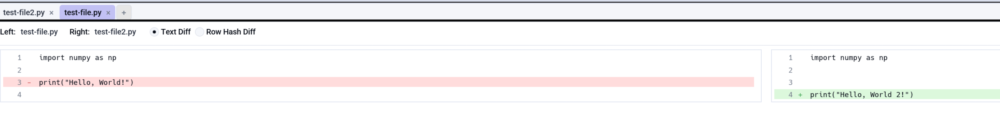
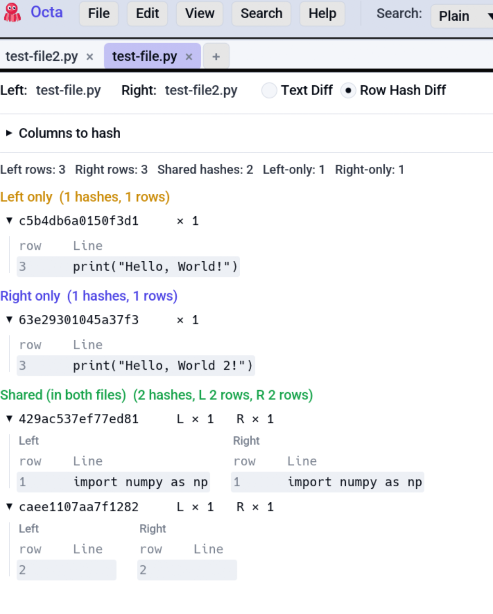
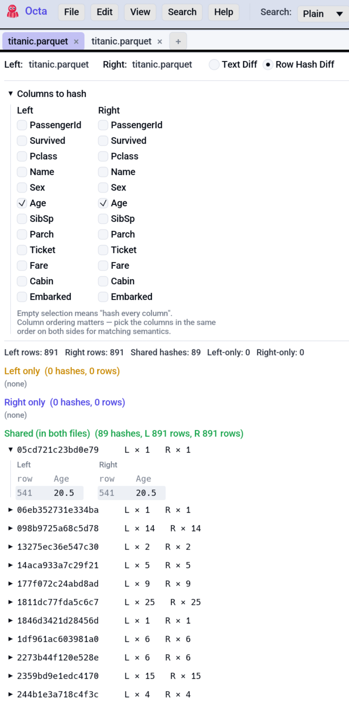

# Compare View

Side-by-side comparison of two files. Two sub-modes: **Text Diff**
for git-style line-by-line diffs, and **Row Hash Diff** for
column-aware row-level comparison. Both work across formats, so you
can compare a CSV to a Parquet by hashing matching columns.

<!-- SCREENSHOT: compare-view-text-diff.png — Compare view in Text Diff mode. Two panes side-by-side with line numbers, +/-/~ markers in the gutter, added lines in green, removed in red, modified in yellow. -->
{ .screenshot-placeholder }

## Three ways to start a comparison

1. **From the View menu**: **View → Compare with…** opens a file
   picker. The active tab is the **left** side; the picked file is
   the **right** side.
2. **Right-click a tab** in the tab strip → **Compare with active
   tab**. The right-clicked tab becomes the right side.
3. **Ctrl-click** exactly one non-active tab to add it to the
   [multi-selection](../tabs-and-sidebar.md#tab-controls), then
   press the
   [**Compare selected tabs** shortcut](../../reference/shortcuts.md#view)
   (default **F9**, remappable). With one tab in the selection
   set, that tab becomes the right side.

The active tab is always the **left** side; the picked file or tab
is always **right**.

## Sub-mode toggle

The Compare view's toolbar has a **Text Diff** / **Row Hash Diff**
radio:

- **Text Diff** uses the
  [`similar`](https://docs.rs/similar/) crate to compute a
  line-by-line LCS diff over the raw text content. Rendered
  side-by-side with `+`/`-` markers in the gutter, additions in
  green, removals in red.
- **Row Hash Diff** hashes each row's selected columns with
  **BLAKE3** (fast, stable across runs) and bucketed the rows into
  **Left-only**, **Right-only**, **Shared**. Cross-format works
  because hashing sees only `CellValue::to_string` output.

The default sub-mode picks itself based on inputs:

- If **both sides have raw text**, defaults to Text Diff.
- Otherwise (binary formats), defaults to Row Hash Diff.

## Text Diff

- Two panes: left = active tab's text, right = picked file's text.
- Line numbers in the gutter for both sides.
- Diff markers in a centre gutter:
  - `+` for a line added on the right.
  - `-` for a line removed (present on the left only).
  - blank for unchanged.
- A **500 ms timeout** kicks in against pathological inputs (the
  diff algorithm has O(n²) worst-case): if the diff doesn't
  complete in time, Octa shows a *"diff too complex"* banner with a
  fallback to "first 100 lines of each."

## Row Hash Diff

<!-- SCREENSHOT: compare-view-row-hash.png — Compare view in Row Hash Diff mode.
Three collapsible buckets visible: Left-only, Right-only, Shared. The Shared
bucket is expanded showing actual cell content (e.g. 5 matched rows). A
column-picker panel showing checkboxes for which columns to hash. -->
{ .screenshot-placeholder }

Works best for tables, but also for text files.

### Picking columns

Above the diff panes, a **column picker** lists every column from
each side. Check the boxes for the columns that should participate
in the hash. Common patterns:

- **Match by primary key**: check just `id` on both sides. Rows
  with the same `id` become candidates for the Shared bucket; rows
  with `id` values not on the other side become Left-only or
  Right-only.
- **Match every column**: leave all unchecked. The hash defaults to
  hashing **every** column on both sides; rows match only if every
  cell agrees.
- **Match by composite**: check `customer_id` + `order_date` to
  match orders.

{ .screenshot-placeholder }

The picker shows columns from both sides, so you can pair the same
logical column even if the names differ (`user_id` on the left,
`uid` on the right).

### Buckets

Once you've picked columns, the diff renders three collapsible
sections:

| Bucket         | Meaning                                                    |
|----------------|------------------------------------------------------------|
| **Left-only**  | Rows whose hash appears only on the left side.             |
| **Right-only** | Rows whose hash appears only on the right side.            |
| **Shared**     | Rows whose hash appears on both sides (potential matches). |

Each bucket can be expanded to show the actual row content. The
display is capped at **50 rows per bucket** to keep rendering
snappy on million-row diffs; the bucket count remains accurate.

### Empty column selection

If you start with no columns selected, the diff hashes **every**
column on both sides, but the bucket display narrows to showing
the first 8 columns to keep the grid readable.

## When to use which sub-mode

| Scenario                                                         | Mode                                                   |
|------------------------------------------------------------------|--------------------------------------------------------|
| Diff two text files ([Markdown](markdown.md), JSON, source code) | Text Diff                                              |
| Diff two [notebooks](notebook.md) (`.ipynb`)                     | Text Diff (after switching to [Raw view](raw-text.md)) |
| Find rows that exist in CSV A but not in CSV B                   | Row Hash Diff                                          |
| Compare a CSV against a SQLite export                            | Row Hash Diff (cross-format)                           |
| Check whether two Parquet files have the same data               | Row Hash Diff                                          |

## Limitations

- **Two-way only.** No three-way merge / compare.
- **No edit mode.** Compare view is display-only; to fix discrepancies,
  switch back to [Table view](../table-view.md) and edit there.
- **No JSON Patch / semantic diff.** Text Diff treats files as
  text; differences in whitespace or key order surface as diffs
  even when the semantics match.

## See also

- [Tabs & Folder Sidebar](../tabs-and-sidebar.md) covers Ctrl-click
  multi-selection used by the F9 shortcut.
- [Settings → Shortcuts](../../reference/settings.md#shortcuts) is
  where to rebind F9 / Compare-selected-tabs.
