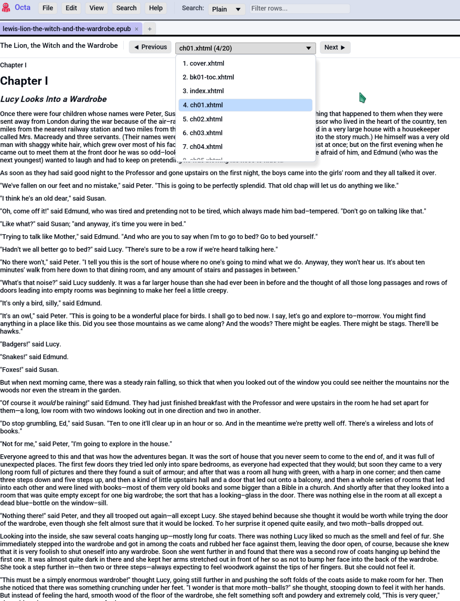

# EPUB Reader

For `.epub` files Octa renders the book chapter-by-chapter as flowing
text, using the same Markdown renderer the Markdown view uses. Each
chapter's XHTML is converted to Markdown once at load time and
cached on the tab, so there's no per-frame conversion overhead.

<!-- SCREENSHOT: epub-reader-view.png — EPUB Reader view of a chapter. Show the
toolbar at top (book title, Previous / Next buttons, chapter combo with the
current chapter highlighted, position N/M), and a chapter body rendered as
paragraphs of flowing text. If possible, include an embedded image (e.g. a
cover) in the thumbnail strip below the text. -->
{ .screenshot-placeholder }

## When the EPUB Reader appears

The EPUB Reader is the **default view** for `.epub` files. The
[Table view](../table-view.md) is still available: every chapter's
paragraphs become rows with `chapter`, `paragraph`, `text` columns,
which is useful for full-text searching the book via the
[search bar](../search-and-filter.md) or
[SQL](../sql.md).

Switch with **View → Table** (or the
[**F4**](../../reference/shortcuts.md#view) cycle shortcut).

## Toolbar

The top toolbar shows:

- **Book title** (from the EPUB's `<dc:title>` metadata).
- **◀ Previous** / **Next ▶** buttons step through chapters.
- **Chapter combo** is the full chapter list with
  `N. <label> (i/total)`. Pick any chapter to jump straight to it.

The chapter `label` is the filename of the chapter's XHTML file
(EPUBs don't carry guaranteed chapter titles, so this is the most
reliable identifier without parsing TOC structures).

## Chapter rendering

Each chapter's body renders via `pulldown_cmark`, the same pipeline
the [Markdown view](markdown.md) uses. That means:

- Bold / italic / strong / em runs render with weight differences.
- Headings (h1-h6) render at varying sizes.
- Lists, blockquotes, code blocks all supported.
- Inline links are clickable where they make sense (internal
  chapter links don't yet navigate, but external `https://...`
  links open in the default browser).

The reading width is capped at `clamp(200.0, 900.0)` pixels,
matching the [Markdown view](markdown.md), so on wide displays the
text doesn't sprawl.

## Embedded images

Images embedded in the EPUB (covers, figures, illustrations) are
decoded once and shown as a **thumbnail strip** beneath the chapter
text. Each thumbnail is capped at 200 px on its longest axis. The
strip persists across chapter switches, since Octa caches decoded
images on the tab so you don't re-decode on every page flip.

!!! note "Why a thumbnail strip, not inline"

    EPUB chapters use HTML `` tags to position images mid-text.
    The egui `pulldown_cmark` walker doesn't expose a clean way to
    weave widgets into paragraph layout, so v1 of the EPUB Reader
    collects all chapter images into a strip below the body. This
    is a known v1 trade-off; inline-in-paragraph positioning is
    deferred.

Image resolution falls back via three strategies:

1. Exact href match against the EPUB's manifest.
2. `/`-prefixed match (some EPUBs normalise paths with a leading `/`).
3. Filename-only match, where `images/cover.jpg` and
   `OEBPS/images/cover.jpg` share `cover.jpg`. First match wins on
   duplicates.

## Image formats supported

PNG, JPEG, GIF, and WebP, which cover the common EPUB image set.
Anything else (TIFF, BMP, SVG) renders as alt-text only.

## Table view fallback

Switch to **View → Table** to inspect the book's text as a flat
table. Three columns:

| Column      | Type  | Notes                                      |
|-------------|-------|--------------------------------------------|
| `chapter`   | Int64 | 1-based chapter index                      |
| `paragraph` | Int64 | 1-based paragraph index within the chapter |
| `text`      | Utf8  | Paragraph text in Markdown form            |

This is the lens to use for:

- Searching the book: type into the
  [toolbar search box](../search-and-filter.md) to filter to
  matching paragraphs.
- Running SQL queries: `SELECT * FROM data WHERE text LIKE '%love%'`
  in the [SQL panel](../sql.md).
- Counting words per chapter, finding the longest paragraph, etc.

## Limitations

- **Read-only.** No edit-and-save-back. EPUB writing isn't on the
  roadmap.
- **No TOC navigation.** The combo shows chapter filenames, not the
  book's declared TOC structure. Following an internal `#anchor`
  link doesn't navigate yet.
- **No font preservation.** EPUBs that bundle custom fonts (sci-fi
  novels with unusual typography, etc.) render in Octa's default
  font.
- **No DRM.** Octa uses `rbook` which doesn't support encrypted
  EPUBs, so Kindle / Adobe Digital Editions files won't open.

## See also

- [Markdown view](markdown.md) uses the same renderer in a more
  familiar context.
- [SQL panel](../sql.md) queries a book's text as a table.
