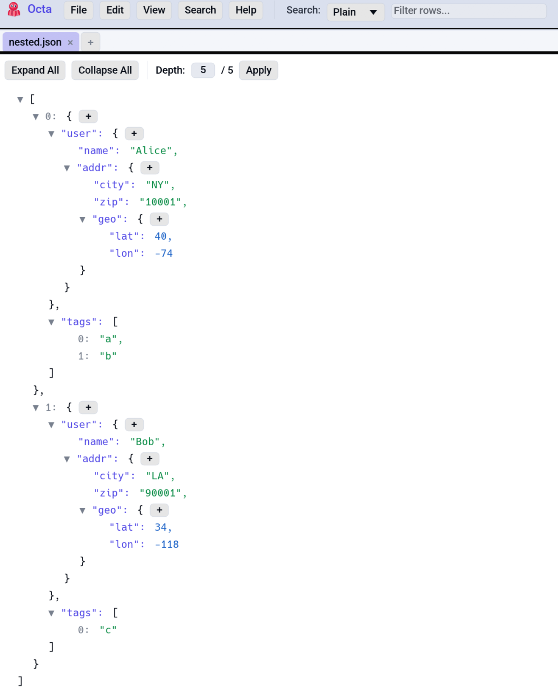

# JSON & YAML Tree View

A Firefox-style collapsible tree for inspecting JSON, JSONL, and
YAML documents. The same renderer handles both: the YAML tree is
fed by `serde_yaml` converted to the same `serde_json::Value` shape
that JSON uses.

<!-- SCREENSHOT: json-tree-view.png: JSON Tree view with several levels expanded, showing keys, nested objects, arrays, mixed value types. -->
{ .screenshot-placeholder }

## When the tree view is available

- `.json` and `.jsonl` files: JSON Tree mode shows in the View
  menu after a successful parse.
- `.yaml` / `.yml` files: YAML Tree mode shows after parse.

Both modes parse the file once at load time and cache the result
on the tab.

You can also open JSON / YAML in [Table view](../table-view.md)
(the file's key-value pairs become columns) or
[Raw view](raw-text.md). The tree is just one of several lenses.

## Interaction

- **Click a value** to select its text
- **Ctrl+C** copies the selected text.
- **Right-click anywhere** for the context menu:
  - Copy JSON (whole document, pretty-printed)
  - Copy YAML (when the tree is YAML)

## Editing in place

The tree view supports in-place editing of both keys (on objects)
and values:

- **Double-click an object key** to enter rename mode. The cell
  becomes a TextEdit pre-filled with the current key. **Enter**
  commits; **Escape** cancels. Key order is preserved by rebuilding
  the underlying `serde_json::Map` (otherwise renaming an object
  key would re-alphabetise the document).
- **Double-click a value** to edit it. Numbers, strings, booleans
  all parse on commit.
- The `+` button next to an expanded `{` opens a small TextEdit
  for adding a new key with a default empty-string value.
- **Array indices are NOT renamable**, since they're position-based.

Edits propagate to the underlying buffer (`tab.raw_content`) by
re-serialising. The tab is flagged as modified; **Ctrl+S** writes
back (see [Saving](../saving.md) for per-format mechanics).

## Expand-to-depth control

Above the tree, a small **Depth: N** input controls auto-expansion.
Type a number to expand the tree to that depth (1 = top-level keys,
2 = one level of nesting, etc.). The maximum depth of the current
document is cached on load and shown next to the input.

## Why the same renderer for both formats

JSON and YAML both serialise into the same recursive enum (objects,
arrays, strings, numbers, booleans, nulls). YAML adds a few
sugar-types (timestamps, sets) that `serde_yaml` lowers into JSON
equivalents during conversion, so by the time the tree renderer
sees the data it doesn't care which format produced it. This means:

- The same edit semantics work for both.
- Saving back uses the format-specific serializer
  (`serde_json::to_string_pretty` for JSON,
  `serde_yaml::to_string` for YAML).
- The right-click "Copy as JSON" / "Copy as YAML" menu items vary
  per format.

## Limitations

- **No JSON Schema validation.** Octa won't tell you if the
  document violates an attached schema.
- **No diff between JSON files.** Use the [Compare view](compare.md)
  with Row Hash Diff or Text Diff.
- **Cycles aren't expected.** JSON/YAML can't represent cycles, but
  YAML anchors that loop would crash the renderer; `serde_yaml`
  flattens them on load.

## See also

- [Settings → Search & Editor](../../reference/settings.md#search-editor)
  for default search mode.
- [SQL panel](../sql.md): JSON Lines opens as rows, queryable via SQL.
- [Parse in new tab](../editing.md#parse-in-new-tab) lifts JSON or
  YAML shaped text out of an individual cell, row, or column into its
  own tree.
