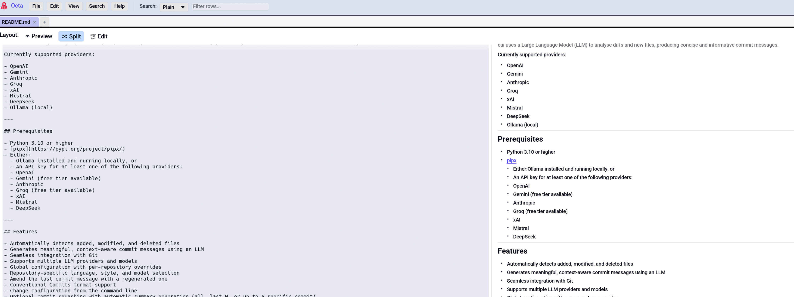

# Markdown View

For `.md` (and `.markdown`, `.mdown`, `.mkd`) files Octa renders a
proper CommonMark preview with bold / italic / strong / headings /
lists / code blocks / blockquotes, plus a live-editing layout so
you can author Markdown right in Octa.

<!-- SCREENSHOT: markdown-view-split.png: Markdown view in Split mode: a TextEdit on the left with raw Markdown, a rendered preview on the right showing headings, bold text, a list, an inline code span. -->
{ .screenshot-placeholder }

## Layout: Preview / Split / Edit

A segmented toggle at the top of the Markdown view picks the
layout. Each option carries a small icon next to the label:

- 👁 **Preview** shows rendered output only. Read-mode.
- 🔀 **Split** (default) shows the TextEdit on the left, live preview
  on the right. Edits update the preview every keystroke.
- 📝 **Edit** shows the TextEdit only, full window width. Useful for
  distraction-free writing.

The default is **Split** so live editing is the out-of-the-box
experience. To change it permanently, save your preference is per-tab
only.

## Reading width cap

The preview column caps at `clamp(200.0, 900.0)` pixels wide, so on
wide monitors the text doesn't sprawl across the screen. This is
the same line-length cap most online readers apply to long-form
content.

## Saving edits

Edits to the buffer are tracked just like [Raw view](raw-text.md)
content: the tab shows `*` when modified, and **Ctrl+S**
([`SaveFile`](../../reference/shortcuts.md#file-operations)) saves
back to the original `.md` file. The preview is for display only;
the disk content matches the editor pane.

## Limitations

- **No images yet.** `` references aren't rendered as actual
  images in the preview (they fall through silently).
- **No footnotes / definition lists.** Plain CommonMark only.
- **No syntect on code blocks.** Code blocks render in monospace
  with a background but without language-specific colours.

For a richer Markdown preview with all these features, open the
file in your text editor of choice and use a dedicated previewer.
Octa's Markdown view is intentionally light.

## See also

- [Notebook view](notebook.md) for `.ipynb`, which also uses the
  same Markdown renderer for text cells.
- [EPUB Reader](epub-reader.md) reuses `render_pulldown` for
  chapter rendering after converting XHTML to Markdown.
