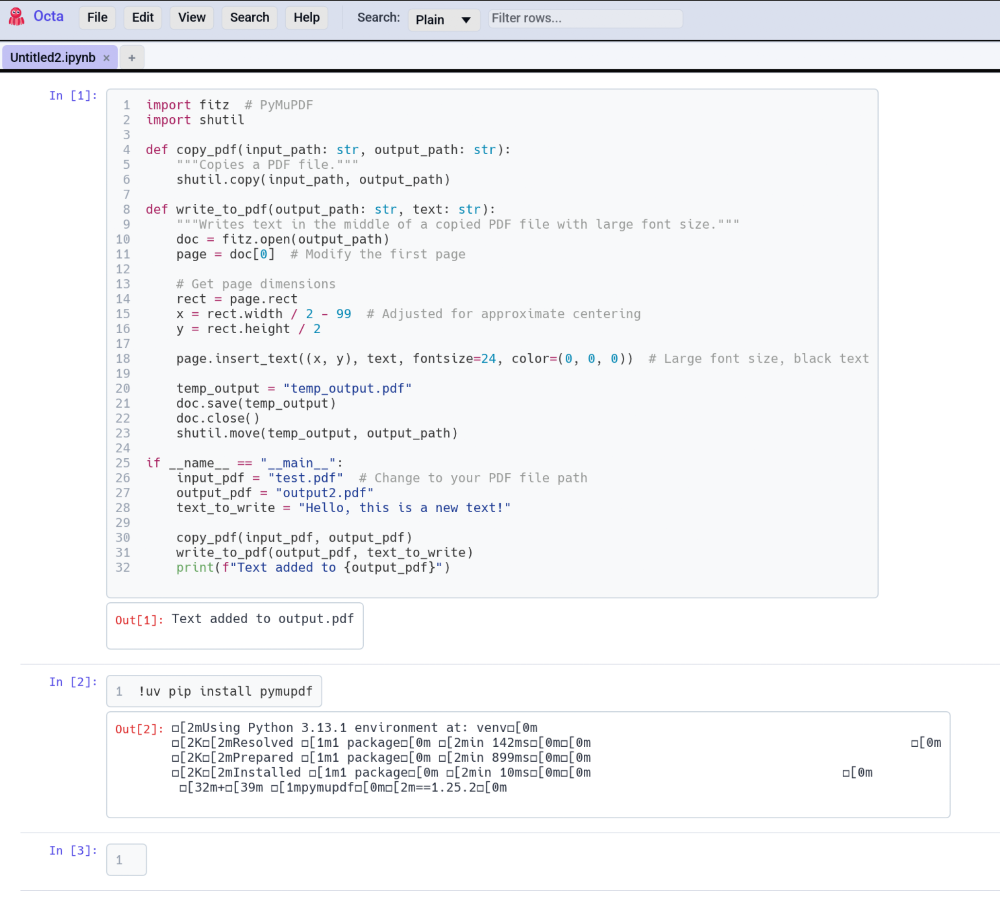

# Notebook View

For `.ipynb` files Octa renders the notebook the way Jupyter does:
code cells with syntect syntax highlighting, Markdown cells through
the Markdown renderer, and outputs (stdout, stderr, plots, HTML)
underneath each code cell.

<!-- SCREENSHOT: notebook-view.png — A notebook view with code cells (Python), a Markdown heading + paragraph, output text below a cell, and a small image output. -->
{ .screenshot-placeholder }

## What gets rendered

| Cell type                    | Renderer                                                             |
|------------------------------|----------------------------------------------------------------------|
| `markdown`                   | The same pulldown-cmark renderer as the [Markdown view](markdown.md) |
| `code` (Python, Julia, R, …) | Syntect with the notebook's declared language                        |
| `raw`                        | Plain monospace                                                      |

Each code cell shows its execution count (`[1]`, `[2]`, etc.) in
the left margin. Cells without an execution count display `[ ]`.

## Output rendering

Outputs are listed below each code cell:

- **Text output** (`stdout`, `stderr`): monospace, no truncation.
- **HTML output**: rendered as plain text in v1 (Octa doesn't
  embed an HTML renderer).
- **Plot output** (image/png base64): decoded and shown inline at
  natural size.
- **Error output**: traceback in red.

## Layout

The notebook view shows cells in document order from top to bottom
in a vertical scroll area. Each cell is rendered in its own bordered
block.

The **Output layout** under
[**Settings → File-Specific → Notebook output layout**](../../reference/settings.md#file-specific)
picks between:

- **Below cell** (default) shows outputs directly under their
  source cell.
- **Side-by-side** shows outputs to the right of the source cell
  (better use of wide screens, but compresses long outputs).

## What you can't do

The notebook view is **read-only**. You can't:

- Run cells.
- Edit cell content (use a Jupyter / VS Code instance for that, then
  reload).
- Add or delete cells.

If you need to inspect the notebook's table-of-values structure
(e.g. to filter all cells matching a pattern), switch to
[**Table view**](../table-view.md). Each cell becomes a row with
`cell_type`, `source`, `outputs`, etc. as columns. From there the
[search bar](../search-and-filter.md) or
[SQL panel](../sql.md) can filter the cells.

## Languages with syntax highlighting

The cell's language comes from the notebook's
`metadata.kernelspec.language` (or `metadata.kernelspec.name` as a
fallback). Octa maps common names to syntect language packs:

| Notebook language          | Syntect grammar         |
|----------------------------|-------------------------|
| `python`, `python3`        | Python                  |
| `julia`                    | Julia                   |
| `r`                        | R                       |
| `rust`                     | Rust                    |
| `bash`, `sh`               | Bash                    |
| `javascript`, `typescript` | JavaScript / TypeScript |

Unknown languages fall back to plain monospace.

## Limitations

- **No interactive widgets.** ipywidgets, Plotly, etc. don't render.
- **No cell numbering edits.** Octa shows what's in the file.
- **No diffing**, though the [Compare view](compare.md) handles
  text-diffing two `.ipynb` files via the Table representation.

## See also

- [Markdown view](markdown.md) shares the renderer that powers
  notebook Markdown cells.
- [Settings → File-Specific](../../reference/settings.md#file-specific)
  is where you change the output layout.
