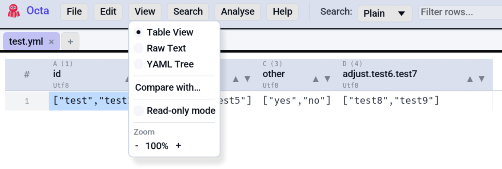

# View Modes

A "view mode" is the way Octa displays the file's content. The
[**Table view**](../table-view.md) is the default for almost every
format, but some files are better viewed in their native shape:
[Markdown](markdown.md) as rendered HTML,
[Jupyter notebooks](notebook.md) with cell outputs,
[EPUB](epub-reader.md) as flowing text,
[GeoJSON on a map](map.md).

Switch view modes via the **View** menu in the toolbar. Only modes
applicable to the current file are enabled.

<!-- SCREENSHOT: view-menu.png: View menu open in the toolbar, showing the radio buttons for Table / Raw Text / Markdown / Notebook / EPUB Reader / Map / JSON Tree / YAML Tree / Compare / Read-only mode. -->
{ .screenshot-placeholder }

## All view modes at a glance

| View mode                              | Available for                        | Read-only?                    |
|----------------------------------------|--------------------------------------|-------------------------------|
| [**Table**](../table-view.md)          | Every format                         | No (editing fully supported)  |
| [**Raw Text**](raw-text.md)            | Anything Octa can read as UTF-8 text | No                            |
| [**Markdown**](markdown.md)            | `.md`, `.markdown`, `.mdown`, `.mkd` | No (edit + preview)           |
| [**Notebook**](notebook.md)            | `.ipynb`                             | Yes                           |
| [**JSON Tree**](json-and-yaml-tree.md) | `.json`, `.jsonl`                    | Edit keys + values in place   |
| [**YAML Tree**](json-and-yaml-tree.md) | `.yaml`, `.yml`                      | Same as JSON Tree             |
| [**EPUB Reader**](epub-reader.md)      | `.epub`                              | Yes                           |
| [**Map**](map.md)                      | `.geojson`                           | Yes (geometry rendering only) |
| [**Compare**](compare.md)              | Any file (compared against another)  | Yes (it's a diff viewer)      |

## Cycling view modes

**F4**
([`CycleViewMode`](../../reference/shortcuts.md#view)) advances through the modes available for the current tab in this order:

```
Table → Raw → Markdown → Notebook → JsonTree → YamlTree → EpubReader → Map → Compare
```

> **Note**: Neither [Chart](../chart.md) nor the [SQL panel](../sql.md)
> are view modes. Chart opens in its own tab via **Analyse → Chart**
> or <kbd>F5</kbd>; the SQL panel docks alongside the table via
> **Analyse → SQL** or <kbd>Ctrl</kbd>+<kbd>J</kbd>. The cycling list
> above only walks true view modes, and cycling inside a chart tab is
> a no-op.

Modes that don't apply to the current file are skipped silently,
so for a CSV, **F4** cycles between Table and Raw only.

## Read-only mode

**F8**
([`ToggleReadOnly`](../../reference/shortcuts.md#view)) toggles a session-only read-only state independent
of view mode. Every editing path short-circuits:

- Double-click on a cell doesn't enter edit mode.
- The [raw text editor](raw-text.md) renders non-interactive.
- Shortcuts for [Insert / Delete row](../editing.md#inserting-rows),
  [Mark](../colour-marking.md), Undo, Redo all no-op.

The status bar shows a `[Read-only]` pill while active. A one-shot
notice explains the mode the first time you toggle it.

Read-only is not persisted, so it resets every time you launch
Octa.

## Per-mode references

- [Raw Text](raw-text.md) shows the file contents as plain text,
  with syntax highlighting for source languages and column
  alignment for CSV/TSV.
- [Markdown](markdown.md) renders CommonMark with a Preview /
  Split / Edit toggle.
- [JSON & YAML Tree](json-and-yaml-tree.md) is a collapsible tree
  view with in-place key + value editing.
- [Notebook](notebook.md) renders Jupyter notebooks with cell
  outputs.
- [EPUB Reader](epub-reader.md) is a chapter-by-chapter reading
  view with embedded images.
- [Map](map.md) is a slippy-map view for GeoJSON feature geometries.
- [Compare](compare.md) is a side-by-side diff of two files (text
  or row hash).

The Table view itself is covered under [Usage → Table View](../table-view.md).
The [SQL panel](../sql.md) and the [Chart](../chart.md) tab live
under the **Analyse** menu and are documented on their own pages.

## See also

- [Table view](../table-view.md) is the default view for almost
  every tabular file.
- [Supported formats](../../getting-started/supported-formats.md)
  lists which formats default to which view mode.
- [Settings → Appearance](../../reference/settings.md#appearance)
  covers the default theme, font size, and view-mode defaults.
- [Keyboard shortcuts](../../reference/shortcuts.md) lists F4 (cycle
  view modes) and F8 (toggle read-only) among others.
