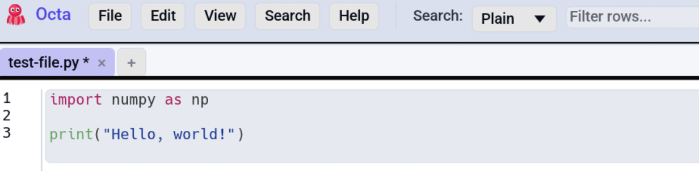
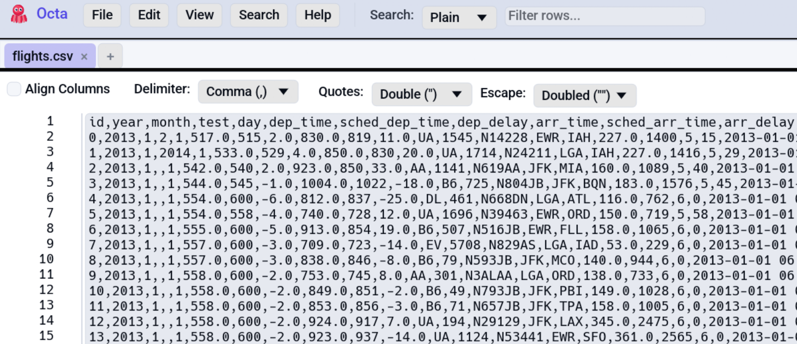
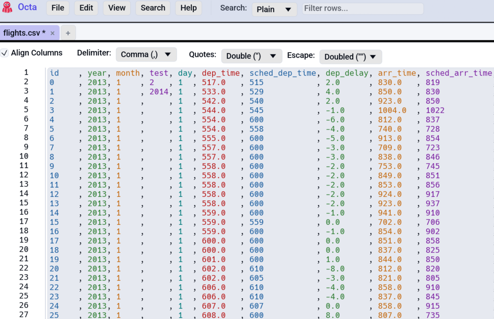

# Raw Text View

The Raw Text view shows the file's content as plain text, useful
when you want to inspect bytes, peek at a parser's view of a file,
or work with formats Octa doesn't have a richer view for (source
code, log files, custom config formats, etc.).

<!-- SCREENSHOT: raw-text-view.png — Raw view of a Python file with syntect highlighting on. Show line numbers, the gutter, syntax-highlighted keywords/strings. -->
{ .screenshot-placeholder }

## When the Raw view appears

- Files Octa doesn't natively recognise open in Raw view by default.
- Any file can be switched to Raw via **View → Raw Text** (or
  pressing
  [**F4**](../../reference/shortcuts.md#view) until you cycle to it).
- When a text-format reader (CSV, JSON, YAML, …) **fails to parse**
  a file, Octa falls back to Raw view automatically and shows a
  dismissible orange banner above the editor with the parser error.

## Editor basics

The Raw view is a multi-line text editor:

- **Line numbers** in the left gutter, monospace.
- **Word wrap** off by default; horizontal scrolling enabled.
- **Standard editing**: type, paste, select with the keyboard, etc.
- **Ctrl+F** / **Ctrl+H** focus the toolbar's search box (no
  in-editor search yet; the toolbar search applies to the buffer).
- **Right-click** opens the context menu with Copy (greyed when
  nothing is selected) and Copy All.

Edits are tracked separately from the table edit overlay. The
status bar shows the unsaved flag (`*`) when the raw content
differs from the on-disk content.

## Syntax highlighting

Source files in supported languages render with full syntax
highlighting. The list deliberately excludes formats that have their
own dedicated view:

| Highlighted                                                                                                                                                  | Not highlighted (use the dedicated view instead)                                                           |
|--------------------------------------------------------------------------------------------------------------------------------------------------------------|------------------------------------------------------------------------------------------------------------|
| Python, Rust, Go, JS / TS, JVM (Java/Kotlin/Scala), C/C++, Shell (bash/zsh/sh), R, Julia, HTML, CSS, Terraform / HCL, plus the rest of syntect's default set | [JSON](json-and-yaml-tree.md), [YAML](json-and-yaml-tree.md), XML, [Markdown](markdown.md), TOML, CSV, TSV |

The Terraform / HCL bundle ships with Octa
(`assets/Terraform.sublime-syntax`, MIT, hand-written) since syntect's
default set doesn't include it.

**Size guard:** files larger than `AppSettings.syntax_highlight_max_bytes`
(default **1 MB**) fall back to plain monospace, because per-frame
syntect tokenisation gets laggy on multi-megabyte files.
Configurable under
[**Settings → Performance → Syntax-highlight size cap**](../../reference/settings.md#performance).
Set to `0` to disable highlighting entirely.

The theme picks `InspiredGitHub` for light UI mode and
`base16-mocha.dark` for dark.

## CSV / TSV: alignment + column colouring

When the file is a `.csv` or `.tsv`, the toolbar exposes extra
controls:

<!-- SCREENSHOT: raw-text-csv-toolbar.png — Raw view of a CSV file with the toolbar showing Quote (Double/Single/Either/None), Escape (Doubled/Backslash/None), Delimiter (Comma/Semicolon/Pipe/Tab), Align Columns toggle. -->
{ .screenshot-placeholder }

- **Delimiter** dropdown picks Comma / Semicolon / Pipe / Tab. The
  value Octa detected on open is pre-selected; changing it
  re-formats the buffer on the fly.
- **Quote** dropdown picks Double (RFC 4180 `"`) / Single (`'`) /
  Either (whichever opens it must close it) / None.
- **Escape** dropdown picks Doubled (`""` → `"`) / Backslash
  (`\"` → `"`) / None.
- **Align columns** toggle pads fields with spaces so every column
  visually lines up. Reads better than raw CSV; turn off to see
  what's actually on disk.

The defaults are RFC 4180: Double + Doubled. Changing the
combination while alignment is on re-formats the buffer immediately
from a cached snapshot of the on-disk content, with no disk re-read.

### Column colouring

When alignment is on, each column gets its own subtle background tint
so you can eyeball which value belongs to which column at a glance.
Toggle under
[**Settings → File-Specific → Colour aligned columns**](../../reference/settings.md#file-specific)
(on by default).

<!-- SCREENSHOT: raw-text-csv-toolbar.png — Raw view of a CSV file with the toolbar showing Quote (Double/Single/Either/None), Escape (Doubled/Backslash/None), Delimiter (Comma/Semicolon/Pipe/Tab), Align Columns toggle. -->

### Large-CSV slow-file prompt

After loading a CSV/TSV larger than **10 MB**, Octa pops a one-shot
prompt asking whether to disable alignment + colouring **for this
tab only** (those features tokenize on every keystroke and get
laggy on very large files). The choice is **transient** and never
persisted to `AppSettings`.

## Parse-error fallback banner

When opening a file with a known text-format extension fails (a
malformed JSON, a broken YAML, etc.), Octa:

1. Loads the file via `TextReader` instead.
2. Switches the active tab into Raw view.
3. Shows a dismissible orange banner above the editor reading
   *"Failed to parse as JSON: …"*

This applies to: CSV, TSV, JSON, JSONL, XML, YAML, TOML, Markdown,
Jupyter, Text. Binary formats (Parquet, Excel, SQLite, …) never
fall back, since raw bytes would render as garbage.

Files larger than **500 MB** skip the fallback and surface the error
in the status message instead, to avoid pulling half a gigabyte of
content into the editor. This refers to the raw text editor. You can load larger files.

## See also

- [Search & Filter](../search-and-filter.md): the toolbar search
  applies to the Raw buffer too.
- [Settings → Performance](../../reference/settings.md#performance)
  covers the size cap for syntect and text-mode extensions.
- [CSV Quote / Escape modes](../../reference/csv-quote-escape.md)
  is the reference for the dropdown combinations.
